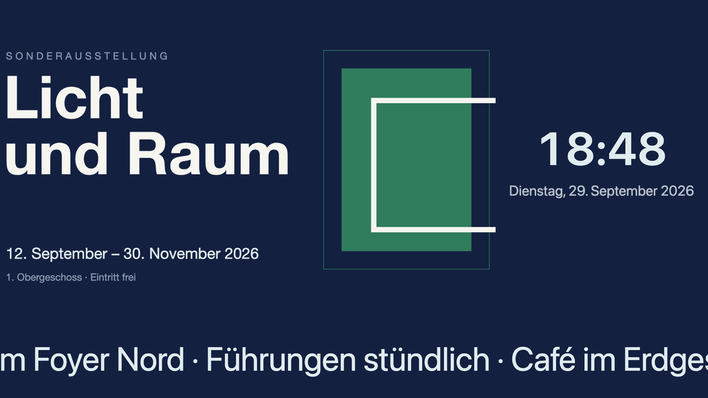
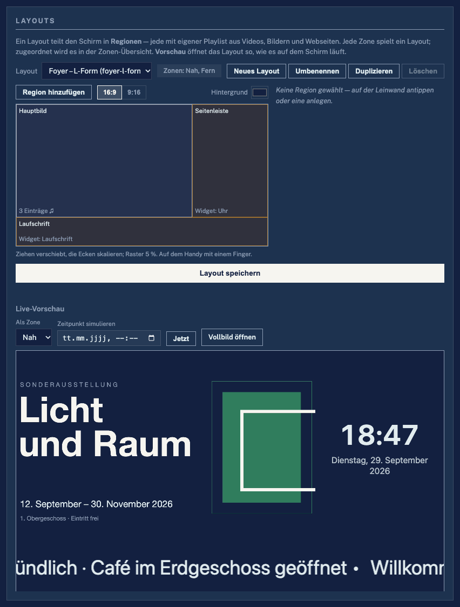
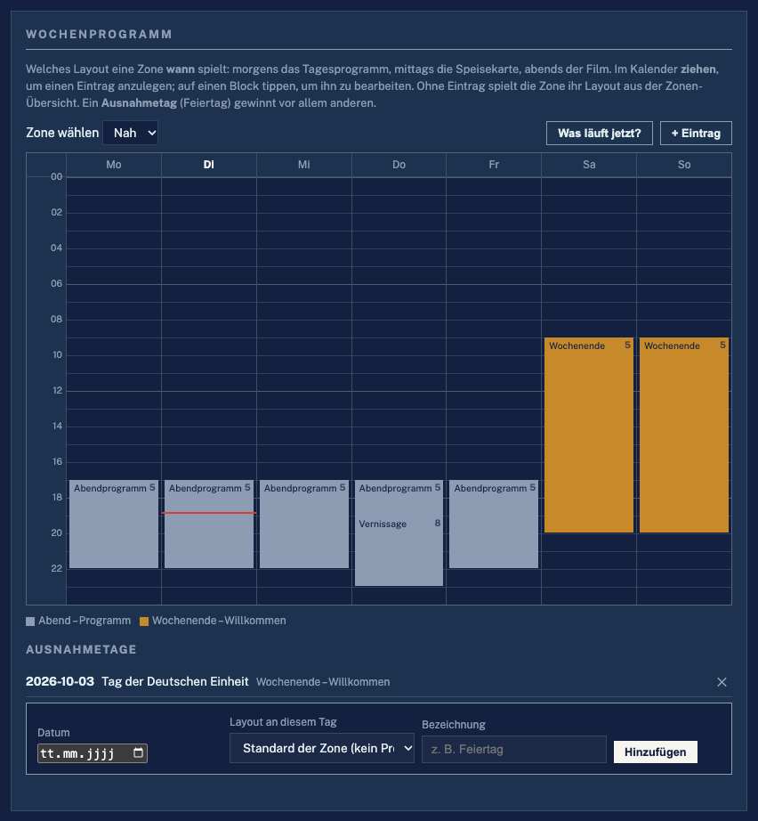
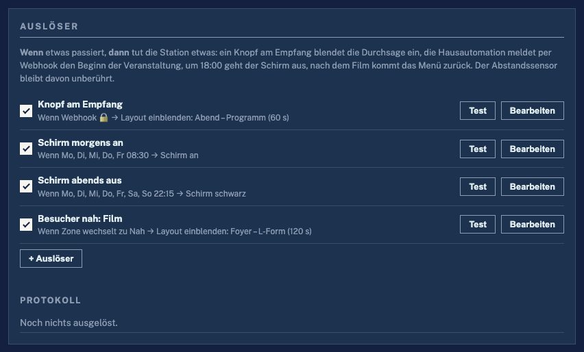
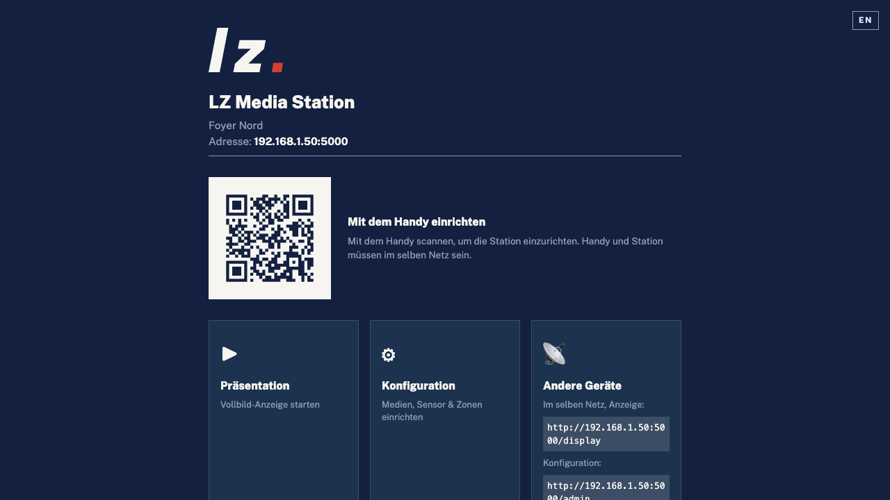
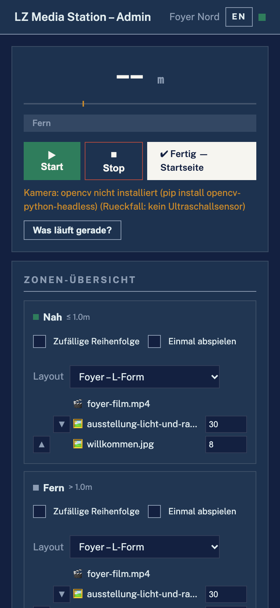
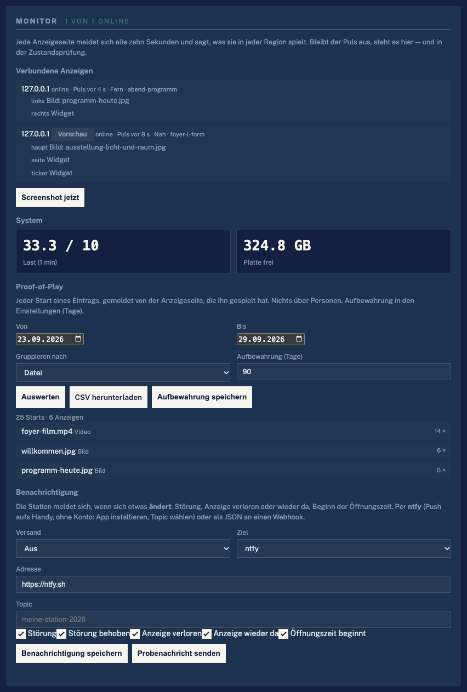
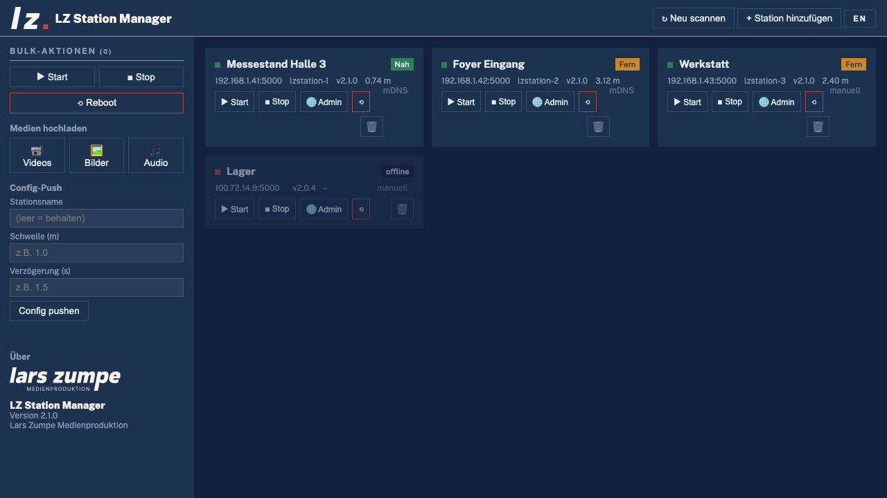

# LZ Media Station

**Deutsch** · [English](README.md)

> **Digital Signage, das auf Menschen reagiert.** Layouts mit Regionen, ein
> Wochenprogramm, Widgets und Sofortmeldungen — gesteuert von einem
> Abstandssensor, einem Taster, einem Webhook oder der Uhr. Läuft auf einem
> **Raspberry Pi** und auf jedem **Mac/Windows**-Rechner, komplett offline,
> mit einem Desktop-Manager für viele Stationen.

[](https://github.com/larszu/lz-media-station/releases/latest)



| Layout-Editor mit Live-Vorschau | Wochenprogramm | Auslöser |
|---|---|---|
|  |  |  |

| Startseite mit QR-Code | Verwaltung am Handy | Monitor | Station Manager |
|---|---|---|---|
|  |  |  |  |

**Projektseite:** https://larszu.github.io/lz-media-station/ — README und Doku, bei jedem Push auf `main` neu gebaut (`.github/workflows/pages.yml`).
Schritt für Schritt für den Betrieb: das [Handbuch](docs/handbuch.md).

---
## Inhalt

- [Warum nicht BrightSign, Crestron, Xibo oder Yodeck?](#warum-nicht-brightsign-crestron-xibo-oder-yodeck)
- [Schnellstart](#schnellstart)
- [Features](#features)
- [Upgrade von 2.x](#upgrade-von-2x)
- [Auf dem eigenen Rechner starten](#auf-dem-eigenen-rechner-starten--ohne-pi)
- [Schnellstart Raspberry Pi](#schnellstart-raspberry-pi)
- [Manuelles Deploy / Update](#manuelles-deploy--update)
- [Bedienung](#bedienung)
- [Multi-Station Manager (Desktop-App)](#multi-station-manager-desktop-app)
- [Architektur](#architektur)
- [API-Übersicht](#api-übersicht)
- [Dokumentation](#dokumentation)
- [Troubleshooting](#troubleshooting)
- [Tailscale (Remote-Verwaltung)](#tailscale-remote-verwaltung)
- [Erscheinungsbild](#erscheinungsbild)

---

## Warum nicht BrightSign, Crestron, Xibo oder Yodeck?

Die etablierten Systeme spielen Inhalte zuverlässig nach Plan. Wo Nutzer am
häufigsten klagen — Gebühren pro Bildschirm, Cloud-Zwang, umständliche
Layout- und Zeitplan-Editoren, keine echte Vorschau, langsames
Veröffentlichen — geht diese Station einen anderen Weg:

| | LZ Media Station | Übliches Signage-System |
|---|---|---|
| **Kosten** | Keine Lizenz pro Bildschirm, kein Abo | Gebühr pro Bildschirm und Monat (Cloud) oder Player-Hardware plus CMS-Lizenz |
| **Offline** | Alles läuft auf der Station; Netz nur für Widgets, die Feeds holen | Cloud-Konto nötig oder ein lokaler Zwischenspeicher, der aus der Cloud nachlädt |
| **Auf Menschen reagieren** | Abstandssensor (Ultraschall oder Kamera), Taster, Webhook, Uhrzeit, Video zu Ende, Zonenwechsel — eingebaut | Meist nur Zeitplan; Interaktion per Skript (BrightSign) oder ein Belegungssensor, der nur an/aus schaltet (Crestron) |
| **Vorschau** | Das Layout läuft in derselben Seite wie auf dem Schirm, zu einem simulierten Zeitpunkt | Screenshot vom Player oder gar keine |
| **Veröffentlichen** | Sofort: die Anzeige bekommt die Änderung per Server-Sent Events | Veröffentlichungs-/Sync-Schritt, der Minuten dauern kann |
| **Hardware** | Ein Raspberry Pi oder jeder Rechner mit Browser — jeder angeschlossene Schirm zählt | Eigener Player je Bildschirm |
| **Einrichtung** | QR-Code auf der Startseite scannen, drei Schritte zum ersten Inhalt | Installateur oder IT-Projekt |

Was sie bewusst (noch) nicht kann: bildgenaue Videowände, automatisches
Umwandeln von Videos, PDF-/PowerPoint-Import — siehe die
[Issues](https://github.com/larszu/lz-media-station/issues).

---

## Schnellstart

```bash
./run-local.sh              # Linux / macOS — unter Windows run_windows.bat
```

1. Die Startseite (`http://localhost:5000/`) zeigt einen **QR-Code** — mit
   dem Handy scannen oder auf **Konfiguration** klicken.
2. Die Verwaltung zeigt oben **„In 3 Schritten zum ersten Inhalt"**: Medien
   hochladen → Layout-Vorlage wählen → einer Zone zuordnen.
3. Auf dem Schirm **Präsentation** (`/display`) öffnen. Fertig.

Auf einem Raspberry Pi richtet `install_pi.sh` Dienst und Kiosk ein — siehe
[Schnellstart Raspberry Pi](#schnellstart-raspberry-pi).

---

## Features

### Inhalte: Layouts, Playlists, Widgets
- **Layouts mit Regionen**: ein Layout teilt den Schirm in Prozent-Rechtecke
  (Vorlagen: Vollbild, geteilt, L-Form, Laufschrift, frei); jede
  Medien-Region spielt ihre eigene **gemischte Playlist** — Video, Bild,
  Webseite, Ton — mit Überblendung, Standzeit je Eintrag und
  **Gültigkeitszeitraum** (`von`/`bis`, im Kern gefiltert, Abgelaufenes
  erreicht den Schirm nie) — siehe [`docs/layouts.md`](docs/layouts.md)
- **Layout-Editor mit Live-Vorschau**: Regionen auf einer Leinwand zeichnen
  (ziehen, an den Ecken skalieren, Raster 5 % — mit der Maus und mit einem
  Finger am Handy), Playlists aus der Bibliothek zusammenstellen, Widgets aus
  einem Katalog einstellen; daneben läuft das Layout in derselben Seite wie
  auf dem Schirm, zu einem **simulierten Zeitpunkt** („zeig mir Dienstag
  18 Uhr"), und **„Was läuft gerade?"** zeigt die echte Szene stumm
- **Widgets** in jeder Region: Uhr (digital/analog), Text-Folie mit Vorlagen
  (Willkommen, Wegweiser, Speisekarte, Hinweis, Öffnungszeiten aus der
  Zeitsteuerung), Laufschrift, Wetter (Open-Meteo, ohne Schlüssel),
  Nachrichten (RSS/Atom), Kalender (ICS, auch als Raumbelegung), QR-Code
  (eingebaut, offline), Webseite mit Einbettungsprüfung, Zähler und **eigene
  HTML-Widgets** aus `widgets/<name>/`. Feeds und Wetter laufen über den Kern
  (`/api/widgets/*`, zwischengespeichert); ohne Netz bleibt der letzte Stand
  stehen — siehe [`docs/widgets.md`](docs/widgets.md)
- **Sofort veröffentlicht**: `GET /api/events` (Server-Sent Events) schickt
  eine neue Szene im Moment der Änderung; Abfragen sind nur der Rückfall
- **Unbeaufsichtigte Anzeige**: ein Schirm im Foyer springt nie in die
  Verwaltung; fehlt etwas, bleibt er schwarz und sagt es in einer dezenten
  Zeile, und ist die Station kurz nicht erreichbar, spielt er die letzte Szene
  weiter

### Zeit und Ereignisse
- **Wochenprogramm**: welches Layout eine Zone **wann** spielt — ein Kalender
  (Mo–So × 24 h), Eintrag durch Ziehen anlegen, Prioritäten, Einträge über
  Mitternacht, Ausnahmetage (Feiertage), „Was läuft jetzt" — siehe
  [`docs/programm.md`](docs/programm.md)
- **Öffnungszeiten**: außerhalb bleibt der Schirm schwarz, der Ton aus und
  nichts löst aus; auf Wunsch schaltet der Fernseher per HDMI-CEC ab — siehe
  [`docs/zeitsteuerung.md`](docs/zeitsteuerung.md)
- **Sofortmeldung**: eine Meldung über allem, auf jedem Schirm, sofort —
  Räumung, Hinweis, Pause; mit Dauer und Signalton; übersteht ein Neuladen der
  Anzeige
- **Auslöser** (wenn … dann …): Webhook (Home Assistant, Node-RED, ioBroker),
  GPIO-Taster, Uhrzeit, Video zu Ende, Zonenwechsel → Layout einblenden,
  Sofortmeldung, Schirm schwarz/an (+ HDMI-CEC), Start/Stop — mit Test-Knopf
  und Protokoll, siehe [`docs/ausloeser.md`](docs/ausloeser.md)
- **Befehle an alle Anzeigen** (`POST /api/befehl`): neu laden, ein Layout
  eine Weile einblenden, Screenshot

### Auf Besucher reagieren
- **Drei wählbare Abstandsquellen** (`sensor_type`):
  - **HC-SR04 Ultraschallsensor** an GPIO 23 (Trigger) / GPIO 24 (Echo) — frei konfigurierbar
  - **Kamera-Erkennung** über eine Webcam (OpenCV + YuNet/Haar) — läuft auch auf **Mac und Windows**, siehe [`docs/sensoren.md`](docs/sensoren.md)
  - **Taster**: der Besucher drückt einen Knopf, statt gemessen zu werden
  - `auto` (die Vorgabe) nimmt, was da ist: ohne Sensor übernimmt die Kamera
- **Zwei oder drei Zonen**: NAH / FERN, wahlweise MITTE dazwischen — jede Zone spielt ihr eigenes Layout, mit einstellbarer Verzögerung gegen Flackern, siehe [`docs/zonen.md`](docs/zonen.md)
- **Nichts wird erfunden**: ohne angeschlossenen Sensor misst die Station nichts und löst nicht aus — die Oberfläche sagt das in klaren Worten, statt einen ausgedachten Abstand zu zeigen
- **Gleichtakt über Stationen**: eine Station folgt über das LAN der Zone einer anderen — ein Sensor steuert eine ganze Wand, siehe [`docs/gleichtakt.md`](docs/gleichtakt.md)
- **Mehrsprachigkeit**: Untertitelspuren (WebVTT) je Video mit Sprachknöpfen auf der Anzeige, siehe [`docs/mehrsprachigkeit.md`](docs/mehrsprachigkeit.md)
- **Wiedergabe je Region**: zufällige Reihenfolge, „einmal abspielen", Reihenfolge, Standzeit je Bild, Video fortsetzen; Lautstärke getrennt für Gesamt / Video / Ton

### Betrieb und Überwachung
- **Monitoring**: jede Anzeigeseite meldet alle 10 s, was sie in jeder Region
  spielt; die Verwaltung zeigt verbundene Anzeigen, einen **Screenshot auf
  Abruf** (echter Bildschirm über `grim`/`scrot` am Pi, sonst von der Seite
  gezeichnet), CPU-Temperatur, Last, Arbeitsspeicher — siehe
  [`docs/monitoring.md`](docs/monitoring.md)
- **Proof-of-Play**: jeder Start eines Eintrags landet in einer SQLite-Datei;
  Auswertung je Datei/Tag/Stunde/Layout und CSV-Export, Aufbewahrung
  einstellbar
- **Benachrichtigung**: ntfy (Push aufs Handy) oder Webhook bei einer
  **Änderung** — Störung, Anzeige weg oder wieder da, Beginn der Öffnungszeit
- **Zustandsprüfung**: Sensor ohne Messung, volle Platte, Zone ohne Inhalt, fehlende Dateien, keine Anzeige verbunden — in der Verwaltung und über `/api/identity` für den Station Manager
- **Besucherstatistik**: Besuche und Verweildauer je Tag/Stunde, CSV-Export — ohne irgendetwas über einzelne Personen zu speichern, siehe [`docs/statistik-und-zustand.md`](docs/statistik-und-zustand.md)
- **Zugangsschutz**: optional eine PIN vor der Verwaltung; schreibende Aufrufe
  brauchen die Sitzung oder den Kopf `X-LZ-Pin` (der Station Manager schickt
  ihn), die Anzeige und der Kiosk selbst bleiben frei — siehe
  [`docs/zugang.md`](docs/zugang.md)
- **Sicherung**: Konfiguration exportieren und wiederherstellen — um eine Station zu klonen oder nach einem Kartenausfall; Sicherungen aus 2.x lassen sich ebenfalls einspielen, siehe [`docs/betrieb.md`](docs/betrieb.md)

### Web-Admin (`/admin`)
- **Deutsch und Englisch**: der Knopf DE/EN in der Kopfzeile schaltet um; ohne Wahl entscheidet die Browsersprache, `?lang=en` in der Adresse legt sie fest (auch für einen Kiosk). Der Station Manager hat denselben Schalter
- **In 3 Schritten zum ersten Inhalt**: eine leere Station zeigt oben eine kurze Anleitung (hochladen → Layout → Zone), die mit dem ersten Inhalt verschwindet
- Zonen-Übersicht mit einem Layout je Zone
- Medienbibliothek mit Reitern (Videos / Bilder / Ton), **Hochladen per Drag-and-drop** mit Fortschritt und **Medien-Check** (warnt vor 4K/60 fps/fremden Codecs, die am Pi ruckeln)
- **Nicht zerstörendes** Löschen: nimmt eine Datei nur aus den Zonen, die Datei bleibt auf der Station
- Live-Status: Abstand, aktive Zone, Zustand der Abstandsquelle in Klartext
- Funktioniert am Handy (einspaltig unter 640 px)

### Systemeinstellungen (eigener Bereich in `/admin`)
- **Abstandsquelle**: Ultraschall (GPIO Trigger/Echo), Kamera (Index, Brennweite) oder Taster (Pin, Haltezeit)
- **Gleichtakt**: eine andere Station als Taktgeber zuweisen
- **Display-IP** für die Fernsteuerung (leer = automatisch)
- **Netzwerk** über `nmcli`: DHCP / statische IP, IP/CIDR, Gateway, DNS
- **WLAN**: an/aus, Netze suchen mit Signalstärke und Verschlüsselung, SSID wählen, Passwort eingeben → verbinden
- **Neustart** direkt aus der Oberfläche

### Startseite (`/`) und Anzeige (`/display`)
- `/` ist ein kleines Menü zur Anzeige und zur Verwaltung, mit einem **QR-Code** zur Verwaltung für die Einrichtung per Handy — **der Kiosk öffnet diese Seite beim Start** und startet die Anzeige nach 15 s, sobald es Inhalt gibt
- `/display` ist der Vollbild-Player (Chromium `--kiosk`) mit Regionen, Überblendungen, Widgets, Untertitelspuren und Sprachknöpfen
- ESC öffnet `/admin` von beiden Seiten; der Mauszeiger blendet sich auf der Anzeige aus

### Manager-Desktop-App (`station-manager/`)
- Verwaltet **viele Stationen** zentral: **automatisch gefunden** über mDNS (`_lzstation._tcp` über Avahi) oder per IP/Hostname hinzugefügt
- **Kacheln oder Liste** je Station: Zone, aktives Layout, Zustand, Anzeigen online, letzter Screenshot als Vorschau (Klick = neuen anfordern), Version
- **Suche, Gruppen und Tags**: Gruppen und Tags liegen nur im Manager; Filter nach Gruppe oder Tag
- **Massenaktionen auf die Auswahl**, mit Ergebnis je Station: Layout einer Zone zuweisen, Layout auf andere Stationen kopieren (mit Liste fehlender Medien), Wochenprogramm kopieren (fehlende Layouts werden vorher gemeldet), Sofortmeldung an/aus, Start / Stop / Neustart, dieselbe Datei auf N Stationen, Einstellungen verteilen
- **Alarme**: alle 10 s abgefragt; geht eine Station offline, springt der Zustand auf *Fehler* oder fällt eine Anzeige weg, gibt es eine Systembenachrichtigung und einen Eintrag in der Alarmliste — je Station stummschaltbar
- **Verwaltung eingebettet**: die `/admin` jeder Station öffnet im Manager; „Im Browser öffnen" bleibt
- **PIN**: Stationen mit Verwaltungs-PIN fragen einmal danach; der Manager schickt sie als `X-LZ-Pin`
- Pakete für **Windows (NSIS + portabel)**, **macOS (Intel + Apple Silicon)**, **Linux (AppImage)**

### Erweitern
- `api_*.py`-Blueprints, `templates/admin/zusatz/`, `static/module/`,
  `static/anzeige/`, `static/i18n/` — eine neue Funktion ist ein Satz neuer
  Dateien, keine Änderung am Kern; siehe [`docs/architektur-v3.md`](docs/architektur-v3.md)

---

## Upgrade von 2.x

Nichts von Hand. Beim ersten Start legt 3.0 die Videos und Bilder jeder Zone
in ein Layout `zone-near` / `zone-mid` / `zone-far` mit einer
Vollbild-Region — mit Reihenfolge, Zufall, „einmal abspielen" und Standzeit je
Bild; die Zonen spielen danach genau, was sie vorher gespielt haben.
Sicherungen aus 2.x lassen sich auf dieselbe Weise in 3.0 einspielen, und ein
Station Manager 2.x kann weiter Medien und Einstellungen verteilen. Alles
Neue — Programm, Auslöser, Widgets, PIN, Benachrichtigung — ist aus, bis es
jemand einschaltet.

Was sich im Einzelnen geändert hat: [`docs/aenderungen-3.0.md`](docs/aenderungen-3.0.md).

---

## Auf dem eigenen Rechner starten — ohne Pi

```bash
./run-local.sh          # Linux / macOS
run_windows.bat         # Windows (Doppelklick)
run_windows.bat --server  # Windows, für einen Aufrufer: Vordergrund, kein Browser
```

Mehr braucht es nicht: Python 3.10+. Das Skript legt beim ersten Lauf eine
`.venv` an, installiert `requirements.txt` und startet den Server.

**Ohne Sensor wird nichts erfunden.** Fehlt `gpiozero` oder ein GPIO-Chip
(also auf jedem Entwicklungsrechner), misst der Ultraschallsensor nichts:
`distance` bleibt „unbekannt", es wird nicht ausgelöst, und der Admin zeigt im
Klartext, dass kein Sensor angeschlossen ist. Wer auf
Mac/Windows ohne Ultraschall-Hardware entwickeln oder ausstellen will, stellt
im Admin unter **Abstandsquelle** auf **Kamera** (Webcam) um; die Einrichtung
steht in [`docs/sensoren.md`](docs/sensoren.md).

`start.sh` ist etwas anderes und bleibt es: der **Kiosk**-Start auf dem
Pi. Er wartet auf einen Wayland-Socket, erschießt `piwiz` und `zenity` und
startet Chromium im Vollbild. Auf einem Notebook läuft davon nichts, und
der Abbruch kommt beim Wayland-Socket — also mit einer Meldung über ein
fehlendes Fenster statt über die Sache.

### Dieser Rechner ist auch ein Mediaplayer — mit allen Bildschirmen

```bash
python3 main.py --list-displays     # was hängt hier?
python3 main.py --play-on all       # Anzeige auf jedem Schirm
python3 main.py --play-on 0,2       # nur auf diesen beiden
```

Die Anzeige ist eine Browser-Seite (`/display`). Auf dem Pi öffnet sie ein
Chromium im Kiosk-Betrieb; auf einem Notebook oder Rechner am Aufbau öffnet
die Station je angeschlossenem Schirm ein eigenes Vollbild-Fenster — **der
eingebaute zählt mit**.

Die Schirme stehen auch im Web-Admin, mit einem Knopf je Schirm. Die Karte
erscheint nur, wenn es etwas zu zeigen gibt: auf einem Pi ohne X wäre eine
leere Liste mit zwei wirkungslosen Knöpfen schlimmer als keine Karte.

**Gefunden werden sie auf dem Weg, den das System selbst anbietet:**

| Windows | `ctypes` → `user32.EnumDisplayMonitors` (Standardbibliothek) |
|---|---|
| macOS | `system_profiler SPDisplaysDataType -json` |
| Linux | `xrandr --listmonitors` |

Keine neue Abhängigkeit.

**Warum Position und nicht „Schirm Nummer 2".** Es gibt
keinen Weg, einem Browser zu sagen „geh auf Schirm 2 in den
Vollbildmodus". Was es gibt, ist ein Fenster an einer **Position**: jeder
Schirm hat im gemeinsamen Koordinatensystem eine Ecke, und ein Fenster, das
dort aufgeht, liegt auf diesem Schirm. Genau das tun `--window-position`
und `--window-size`.

Daraus folgen zwei Grenzen, die hier stehen statt sich zu verstecken:

* Wer die Schirme in den Systemeinstellungen **verschiebt, während ein
  Fenster offen ist**, bekommt es nicht nachgeführt. Aufgezählt wird beim
  Öffnen.
* macOS nennt in seiner Ausgabe **keine Koordinaten**. Die Ecken werden
  deshalb aus den Breiten aufgereiht: Hauptschirm bei 0/0, die übrigen
  rechts daneben. Wer seine Schirme übereinander legt, bekommt das Fenster
  an der falschen Stelle — es geht dann trotzdem auf und lässt sich
  verschieben.

**Chrome, Chromium oder Edge.** Firefox und Safari können kein Fenster auf
einem bestimmten Schirm öffnen, deshalb stehen sie nicht in der Liste.
Findet die Station keinen Browser, sagt sie, **wo sie gesucht hat** — ein
„geht nicht" ohne Ort ist für den Nutzer dasselbe wie Schweigen.

Und jeder Schirm bekommt ein eigenes Browser-Profil. Ohne das bleibt der
zweite schwarz: ein zweiter Chrome-Aufruf mit demselben Profil faltet sich
in das bestehende Fenster, statt ein neues zu öffnen.

`tests/test_displays.py` misst die Auswertung gegen echte Ausgaben von
`system_profiler` und `xrandr` — in CI gibt es keinen Bildschirm, und die
Frage ist ohnehin eine andere: ob aus dem Text die richtige Ecke wird —
auch für Schirme **links** vom Hauptschirm (`-1920+0`) und für die
Bildraten-Angabe der Apple-Silicon-Macs (`1512 x 982 @ 120.00Hz`).

### Andere Geräte im selben Netz

Der Server bindet auf alle Schnittstellen, und **beim Start steht die
Adresse da, die man eintippen kann**:

```
  LZ Media Station
    hier:            http://127.0.0.1:5000/
    im selben Netz:  http://192.168.1.42:5000/

    Anzeige (Schirm am Aufbau):   http://192.168.1.42:5000/display
    Verwaltung (Handy/Notebook):  http://192.168.1.42:5000/admin
```

Dieselben Adressen stehen auch auf der Startseite der Station.

Beliebig viele Geräte können gleichzeitig `/display` öffnen — ein zweiter
Schirm am Aufbau, ein Tablet im Foyer. `/admin` ist die Verwaltung.

**`--host 127.0.0.1` sperrt das ab** — sinnvoll in fremden Netzen
(Hotel-WLAN, Messe, Kundennetz), in denen die Verwaltung sonst offen stünde.
Die Vorgabe ist `0.0.0.0`, weil genau das der Zweck der Station ist.

`tests/test_web_clients.py` fragt über die **LAN-Adresse** dieses Rechners
an, nicht über `localhost` — das ist derselbe Weg, den ein Handy nimmt —
und prüft die Gegenprobe mit: bindet `--host 127.0.0.1` wirklich nur lokal?
Ohne sie wäre der Schalter eine Beschriftung ohne Wirkung.

## Schnellstart Raspberry Pi

Frischer Pi (Raspberry Pi OS Bookworm, Wayland/labwc-Session, User `pi`):

```bash
curl -sSL https://raw.githubusercontent.com/larszu/lz-media-station/main/install_pi.sh | bash
```

Der Installer erledigt automatisch:

1. Systempakete (`python3-flask`, `python3-gpiozero`, `chromium-browser`, `avahi-daemon`, `git`)
2. Klont das Repo nach `~/pi_media_station`
3. Erstellt Medien-Ordner (`videos/`, `images/`, `audio/`, `subtitles/`)
4. Schreibt `~/.config/autostart/LZ_Media_Station.desktop`
5. Chromium-Policy: deaktiviert Translate-Banner
6. Unterdrückt störende Login-Dialoge (`gnome-keyring*`)
7. **Sudoers-Regel** für `nmcli` und `reboot` (passwortlos für `pi`)
8. **Avahi-Service** `_lzstation._tcp` für mDNS-Discovery durch den Manager

Nach Installation:

```bash
~/pi_media_station/start.sh    # sofort starten
# ODER
sudo reboot                    # nutzt Autostart
```

Web-UI dann unter `http://<pi-ip>:5000/admin`.

---

## Manuelles Deploy / Update

### Erstmaliges Klonen

```bash
git clone https://github.com/larszu/lz-media-station.git ~/pi_media_station
cd ~/pi_media_station
chmod +x start.sh install_pi.sh
bash install_pi.sh   # idempotent, erkennt vorhandenes Repo
```

### Update auf neueste Version

```bash
cd ~/pi_media_station
git pull
pkill -f 'python3 main.py' || true
nohup python3 main.py >/tmp/main.log 2>&1 &
```

oder einfacher:

```bash
sudo reboot
```

### Einzeldateien per SCP (vom Entwickler-PC)

```powershell
# Windows PowerShell
cd "c:\Users\<user>\Documents\LZ Media Station\pi_media_station"
scp web_ui.py templates/admin.html static/app.js pi@<pi-ip>:/tmp/
ssh pi@<pi-ip> "cp /tmp/web_ui.py ~/pi_media_station/web_ui.py && \
                cp /tmp/admin.html ~/pi_media_station/templates/ && \
                cp /tmp/app.js ~/pi_media_station/static/ && \
                pkill -f 'python3 main.py' || true; \
                sleep 2; cd ~/pi_media_station; \
                setsid nohup python3 main.py >/tmp/main.log 2>&1 < /dev/null &"
```

### Auf Windows lokal entwickeln

```cmd
run_windows.bat
```

Startet Flask auf `http://localhost:5000`. Ohne Ultraschall-Hardware misst die
Station nichts; für eine Webcam im Admin unter **Abstandsquelle** auf
**Kamera** umstellen (siehe [`docs/sensoren.md`](docs/sensoren.md)).

---

## Bedienung

### Web-Admin (`/admin`)

| Bereich | Funktion |
|---|---|
| **Status** | Distanz (bzw. Gedrückt/Frei beim Taster), Zone, Start/Stop, Klartext-Zustand der Quelle |
| **Zustand** | Befunde der Zustandsprüfung — toter Sensor, volle Platte, fehlende Dateien |
| **Statistik** | Besuche heute/gesamt, Tagesverlauf, letzte Tage, CSV-Download |
| **Sicherung** | Konfiguration exportieren und einspielen |
| **Zonen** | Je Zone: Shuffle, „einmal abspielen", Reihenfolge (▲▼), Standzeit je Bild |
| **Bibliothek** | Upload (mit Medien-Check), Zuweisung per Knopf je Zone, Löschen nur aus Zonen |
| **Untertitel** | Sprachen festlegen, `.vtt` hochladen, je Video und Sprache zuordnen |
| **Einstellungen** | Name, Zonen-Stufen, Schwellen, Verzögerung, Bildintervall, Lautstärken, Video-Resume |
| **Zeitsteuerung** | Wochenplan, HDMI-CEC |
| **Über** | Hauptlogo, Name, Version |
| **Systemeinstellungen** | Abstandsquelle, Gleichtakt, Anzeige-IP, Netzwerk, WLAN, Reboot |

Die Zuweisung eines Mediums zu einer Zone passiert in der **Bibliothek** über
einen Knopf je Zone, die Reihenfolge in der **Zonen-Übersicht** über Pfeile —
bewusst kein Drag-and-Drop: diese Seite wird vom Handy bedient, und Ziehen mit
dem Daumen ist dort der unzuverlässigste Weg.

### Anzeige (`/display`)

- ESC → `/admin`
- Beim Pi-Boot lädt der Chromium-Kiosk die **Startseite `/`** (siehe `start.sh`);
  von dort geht es mit einem Klick auf die Anzeige. Ein zweites Gerät kann
  `/display` auch direkt öffnen.

### Netzwerk konfigurieren

In `/admin` → **Systemeinstellungen** → **Netzwerk**:

1. Aktive Verbindung wählen
2. **DHCP** oder **Statisch**
3. Bei statisch: IP/CIDR (z. B. `192.168.1.50/24`), Gateway, DNS
4. **Netzwerk übernehmen**

> Verbindung wird kurz getrennt — danach neue IP im Browser eingeben.

### WLAN konfigurieren

In `/admin` → **Systemeinstellungen** → **WLAN**:

1. WLAN-Toggle aktivieren
2. **Netzwerke scannen**
3. SSID anklicken → Passwort eingeben
4. **Mit WLAN verbinden**

> Bei aktiver Ethernet-Verbindung bleibt diese bestehen — du kannst Pi parallel per WLAN ins Netz bringen.

---

## Multi-Station Manager (Desktop-App)

Im Ordner `station-manager/` liegt eine Electron-App für Win/Mac/Linux.

### Entwicklung

```bash
cd station-manager
npm install
npm start
```

### Build (Distributables)

```bash
npm run dist:win    # Windows: NSIS Installer + Portable .exe
npm run dist:mac    # macOS: DMG für Intel + Apple Silicon
npm run dist        # plus Linux AppImage
```

Artefakte in `station-manager/dist/`.

### Workflow

1. **Discovery**: alle Pis im LAN mit Avahi-Service erscheinen automatisch
2. **Manuell hinzufügen**: per IP, wenn mDNS nicht durchkommt (z. B. via Tailscale)
3. **Ordnen**: Stationen bekommen eine Gruppe und Tags (Seitenleiste, „Gruppe und Tags"); oben filtern
4. **Auswählen**: Kacheln anklicken, oder „Alle sichtbaren" für alles, was der Filter zeigt
5. **Handeln**: Layout zuweisen oder kopieren, Wochenprogramm kopieren, Sofortmeldung, Start / Stop / Reboot, Upload, Config-Push — die Ergebnisliste zeigt jede Station einzeln
6. **Beobachten**: rote Kacheln und der Alarmzähler zeigen, was Aufmerksamkeit braucht; die Glocke an einer Kachel schaltet die Station stumm
7. **Verwaltung**: „Verwaltung" an einer Kachel öffnet `/admin` im Manager

Persistente Daten der App (`stations.json`, `pins.json`, `gruppen.json`): `%APPDATA%\station-manager\` (Win) bzw. `~/Library/Application Support/station-manager/` (Mac).

---

## Architektur

```
                ┌─────────────────────────────┐
                │ LZ Station Manager (Electron)│
                │   Win / macOS / Linux       │
                └──────────────┬──────────────┘
                               │ HTTP/JSON (LAN oder Tailscale)
        ┌──────────────────────┼──────────────────────┐
        │                      │                      │
   ┌────▼────┐            ┌────▼────┐            ┌────▼────┐
   │ Pi #1   │            │ Pi #2   │            │ Pi #N   │
   │ Flask   │            │ Flask   │            │ Flask   │
   │ + Avahi │            │ + Avahi │            │ + Avahi │
   │ HC-SR04 │            │ HC-SR04 │            │ HC-SR04 │
   └─────────┘            └─────────┘            └─────────┘
```

**Pi-Stack:** (Wiedergabe passiert im Browser, nicht in Python — es gibt
keinen Player-Prozess.)

| Modul | Aufgabe |
|---|---|
| `main.py` | Controller: Zonen-Zustandsmaschine, Wochenplan, Statistik-Fortschreibung, Szenen-Ereignisse |
| `web_ui.py` | Flask-Routen (`/`, `/admin`, `/display`, `/api/*`), SSE, Erweiterungs-Hooks |
| `config_schema.py` | Vorgaben **und** Grenzen; Heilung beim Laden, Ablehnung beim Schreiben |
| `layouts.py` | Layouts, Regionen, Playlists (3.0): Schema, Migration alter Zonenlisten, Spiegel in die Zone, Datumsfilter |
| `api_layouts.py` | Blueprint für die Layout-Routen (`/api/layouts`) — das Muster für jede `api_*.py`-Erweiterung |
| `widgets.py` | Widget-Kern (3.0): Abruf mit Zwischenspeicher, RSS/Atom- und ICS-Parser (nur Standardbibliothek), Open-Meteo, Einbettungs-Prüfung, eigene Widget-Ordner |
| `api_widgets.py` | Blueprint für die Widget-Proxys (`/api/widgets/*`) und die Dateien eigener Widgets (`/widgets/<name>/<path>`) |
| `ereignisse.py` | Ereignisbus für Server-Sent Events (rein, ohne Flask) |
| `api_anzeige.py` | Puls der Anzeigeseiten, Screenshot auf Abruf, Einstellungen der Benachrichtigung (`/api/anzeige/*`, `/api/benachrichtigung/*`) |
| `wiedergabe_log.py` | Proof-of-Play: SQLite-Protokoll jedes gestarteten Eintrags, Deduplizierung, Aufbewahrung, CSV |
| `api_wiedergabe.py` | Blueprint für die Proof-of-Play-Routen (`/api/wiedergabe/*`) |
| `benachrichtigung.py` | Melder: meldet **Übergänge** (Störung, Anzeige weg/zurück, Öffnungszeit) per ntfy oder Webhook; reine Entscheidung, Versand getrennt |
| `zugang.py` | Zugangsschutz: PIN-Hash (PBKDF2), Fehlversuche, die reine Entscheidung `entscheide()` — die PIN liegt in `zugang.json`, nicht in der Konfiguration |
| `api_zugang.py` | Anmeldeseite, `/api/zugang/*`, der Türsteher (`before_request`) |
| `programm.py` | Wochenprogramm (welches Layout wann, Prioritäten, Ausnahmetage) und Sofortmeldung — rein, die Zeit wird hereingereicht |
| `api_programm.py` | Blueprint: `/api/programm`, `/api/meldung`; hängt die Programm-Regel in den Controller |
| `ausloeser.py` | Auslöser: Quellen (Webhook, Taster, Uhrzeit, Video zu Ende, Zone) und Aktionen; eigener Faden, GPIO-Taster, Protokoll |
| `api_ausloeser.py` | Blueprint: `/api/ausloeser`, `/api/trigger/<id>` (Webhook) |
| `VERSION` | Die eine Quelle der Version (`/api/identity`, `/api/status`, `main.py --version`) |
| `sensor.py` | Basis aller Abstandsquellen (Mittelwert, Veralten) + HC-SR04 |
| `camera_sensor.py` | Kamera-Quelle (OpenCV + YuNet/Haar), plattformübergreifend |
| `button_sensor.py` | Taster-Quelle am GPIO |
| `auto_sensor.py` | Wahl mit Rückfall: HC-SR04, und wenn es den nicht gibt, die Kamera |
| `sync.py` | Gleichtakt: folgt der Zone einer anderen Station |
| `zeitplan.py` | Öffnungszeiten (rein, ohne Uhr — deshalb testbar) |
| `statistik.py` | Besuche zählen, auswerten, atomar speichern |
| `gesundheit.py` | Zustandsprüfung (rein, Lage wird hereingereicht) |
| `medien_check.py` | Beurteilt hochgeladene Videos (ffprobe optional) |
| `tv_cec.py` | Fernseher per HDMI-CEC schalten (wirft nie) |
| `displays.py` | Bildschirme dieses Rechners finden und bespielen |
| `static/`, `templates/` | Frontend (Admin, Anzeige, Startseite); die Admin-Karten sind Includes in `templates/admin/` |
| `static/module/`, `static/anzeige/`, `static/i18n/`, `templates/admin/zusatz/` | Erweiterungspunkte — Dateien dort werden automatisch eingebunden |
| `static/anzeige/widgets.js`, `widgets/` | Die Widgets der Anzeige (`window.LZ_WIDGETS`, samt QR-Encoder) und der Ordner für eigene HTML-Widgets |
| `static/i18n.js`, `static/i18n-en.js` | Oberflächensprache: Deutsch als Quelle, englisches Wörterbuch; `tests/test_i18n.py` findet fehlende Einträge |
| `lzstation.service` | Avahi mDNS für die Manager-Discovery |

**Manager-Stack:**
- `main.js` – Electron-Hauptprozess, mDNS (`bonjour-service`), HTTP-Multipart-Upload
- `preload.js` – contextIsolation IPC-Bridge
- `renderer/` – UI

---

## API-Übersicht

Alle Endpoints unter `http://<pi-ip>:5000`.

### Zustand und Wiedergabe

| Method | Path | Beschreibung |
|---|---|---|
| GET | `/api/status` | Distanz, Zone, Sensor-Zustand, Betriebsruhe, IP, komplette Config |
| GET | `/api/scene` | Was gerade zu spielen ist: Zone, **Layout** mit Regionen und Playlists, Lautstärken, Untertitel. `?layout=<id>[&zone=&zeit=]` = Vorschau eines Layouts |
| GET | `/api/events` | **Server-Sent Events**: `scene`, `config`, `befehl`; mit `?status=1` zusätzlich jede Sekunde `status` |
| POST | `/api/befehl` | Befehl an alle Anzeigen: `reload`, `zeige_layout` {layout_id, dauer_s}, `screenshot` |
| GET | `/api/sync` | **Takt für andere Stationen**: nur Zone + Betriebsruhe (siehe [Gleichtakt](docs/gleichtakt.md)) |
| GET | `/api/health` | Befunde der Zustandsprüfung + Gesamtstufe |
| GET | `/api/identity` | Station-ID, Name, Version, Zustandsstufe (Manager-Discovery) |
| POST | `/api/start` · `/api/stop` | Sensor-Steuerung starten / anhalten |

### Konfiguration

| Method | Path | Beschreibung |
|---|---|---|
| POST | `/api/config` | Konfiguration schreiben (**lehnt ab** und nennt das Feld). Gelesen wird sie über `/api/status` |
| GET | `/api/backup` | Konfiguration als JSON-Datei herunterladen |
| POST | `/api/restore` | Sicherung einspielen (**repariert** statt abzulehnen; alte Sicherungen werden in Layouts migriert) |

### Layouts (3.0)

| Method | Path | Beschreibung |
|---|---|---|
| GET | `/api/layouts` | Alle Layouts und welche Zone welches spielt |
| GET | `/api/layouts/vorlagen` | Vorlagen (`vollbild`, `geteilt`, `l-form`, `ticker`, `frei`) |
| POST | `/api/layouts` | Anlegen `{name, vorlage?, id?}` — die Kennung entsteht aus dem Namen |
| GET/PUT/DELETE | `/api/layouts/<id>` | Lesen, ersetzen (**lehnt ab** und nennt das Feld), löschen (409, solange eine Zone es spielt) |
| POST | `/api/layouts/<id>/duplizieren` | Kopie `{name?, id?}` |

### Wochenprogramm, Sofortmeldung, Auslöser (3.0)

| Method | Path | Beschreibung |
|---|---|---|
| GET/PUT | `/api/programm` | Das ganze Programm `{eintraege, ausnahmen}` (PUT **lehnt ab** und nennt das Feld) |
| GET | `/api/programm/jetzt` | Je Zone: Layout, Quelle (`programm` · `ausnahme` · `zone`), Eintrag |
| GET | `/api/programm/vorschau` | `?von=&bis=&zone=&raster=` — Auflösung als Abschnitte für den Kalender |
| GET/POST/DELETE | `/api/meldung` | Sofortmeldung: lesen, setzen `{text, untertext?, farbe?, textfarbe?, dauer_s?, ton?}`, beenden |
| GET/PUT | `/api/ausloeser` | Alle Auslöser (PUT **lehnt ab**, auch Pin-Kollisionen) |
| GET | `/api/ausloeser/protokoll` | Die letzten Auslösungen |
| POST | `/api/ausloeser/<id>/test` | Von Hand auslösen |
| POST | `/api/trigger/<id>` | **Webhook** (Kopfzeile `X-LZ-Token` oder `?token=`); `_video_ende` meldet die Anzeige |

### Widgets (3.0)

| Method | Path | Beschreibung |
|---|---|---|
| GET | `/api/widgets/rss` | `?url=&anzahl=` — RSS 2.0/Atom geparst: `{titel, eintraege[], veraltet}` |
| GET | `/api/widgets/ics` | `?url=&tage=` — iCalendar-Termine, Wiederholungen (DAILY/WEEKLY) ausgerollt |
| GET | `/api/widgets/wetter` | `?lat=&lon=&einheit=c\|f` — aktuelles Wetter und 4 Tage (Open-Meteo) |
| GET | `/api/widgets/einbettbar` | `?url=` — darf die Seite in einen Rahmen? (`X-Frame-Options`, `frame-ancestors`) |
| GET | `/api/widgets/eigene` | Eigene HTML-Widgets unter `widgets/` |
| GET | `/widgets/<name>/` · `/widgets/<name>/<path>` | Dateien eines eigenen Widgets — nur aus seinem Ordner |

Alle Proxys: nur GET, nur `http(s)`, höchstens 1 MB und 5 s, keine Cookies,
Zwischenspeicher je Adresse (Vorgabe 300 s, `LZ_WIDGET_CACHE_S`); scheitert der
Abruf, kommt der letzte Stand als `veraltet: true`, Fehler als `{fehler}` mit
400/502.

### Medien

| Method | Path | Beschreibung |
|---|---|---|
| GET | `/api/media/<type>` | Dateiliste (`videos`, `images`, `audio`, `subtitles`) |
| POST | `/api/upload/<type>` | Multipart-Upload; bei Videos mit **Medien-Check** in der Antwort |
| DELETE | `/api/media/<type>/<name>` | Aus allen Zonen entfernen (Datei bleibt liegen) |
| GET | `/media/<type>/<name>` | Datei ausliefern |

### Monitoring, Proof-of-Play, Zugang (3.0)

| Method | Path | Beschreibung |
|---|---|---|
| POST | `/api/anzeige/puls` | Eine Anzeigeseite meldet sich (alle 10 s): Kennung, Layout, Zone, was je Region läuft, letzte JS-Fehler |
| GET | `/api/anzeige` | Alle Anzeigen mit `online`, `alter_s`, Regionen, letztem Screenshot |
| GET | `/api/anzeige/system` | Systemwerte des Kerns (Temperatur, Last, RAM, Platte; `null`, wo es sie nicht gibt) |
| POST | `/api/anzeige/screenshot/anfordern` | Screenshot anfordern: echter Bildschirm (`grim`/`scrot`) oder Befehl an die Anzeigeseiten, wartet bis 4 s |
| POST | `/api/anzeige/screenshot` | Eine Anzeigeseite liefert ihr Bild (`{kennung, bild: dataURL}`, max. 2 MB) |
| GET | `/api/anzeige/screenshot` | Das jüngste Bild (`?kennung=`), Kopf `X-LZ-Zeit` |
| POST | `/api/wiedergabe` | Proof-of-Play: `{kennung, eintraege: [{zeit, region, typ, name\|url, layout_id, zone}]}` — dedupliziert |
| GET | `/api/wiedergabe/zusammenfassung` | Starts je `gruppe=datei\|tag\|stunde\|layout\|zone`, `?von=&bis=` (Kalendertage) |
| GET | `/api/wiedergabe.csv` | Jeder Start eine Zeile (`;`-getrennt), `?von=&bis=` |
| GET/PUT | `/api/benachrichtigung` | Einstellungen `{aktiv, ziel_typ: ntfy\|webhook, url, topic, ereignisse}` |
| POST | `/api/benachrichtigung/test` | Probenachricht mit dem übergebenen (oder gespeicherten) Ziel |
| GET/POST/DELETE | `/api/zugang` | PIN gesetzt? / setzen oder ändern (`{pin, alt?, sitzungsdauer_h?}`) / aufheben |
| POST | `/api/zugang/login` · `/api/zugang/logout` | Sitzung für `/admin` (die Seite ist `/login`) |

### Statistik

| Method | Path | Beschreibung |
|---|---|---|
| GET | `/api/statistik` | Besuche heute/gesamt, Tagesverlauf, letzte Tage |
| GET | `/api/statistik.csv` | Tageswerte als CSV (Semikolon, Komma als Dezimalzeichen) |
| POST | `/api/statistik/reset` | Zähler auf null |

### Dieser Rechner und sein System

| Method | Path | Beschreibung |
|---|---|---|
| GET | `/api/displays` | Angeschlossene Bildschirme dieses Rechners |
| POST | `/api/displays/play` · `/api/displays/stop` | Anzeige-Fenster öffnen / schließen |
| GET/POST | `/api/system/network` | nmcli IP-Konfiguration |
| GET/POST | `/api/system/wifi` | WLAN ein/aus, Scan, Verbinden |
| POST | `/api/system/reboot` | `sudo reboot` |

---

## Dokumentation

Das README gibt den Überblick. Die Themen, die mehr als einen Absatz brauchen,
stehen in [`docs/`](docs/README.md) — dort steht das Wie und, wichtiger, das
**Warum**.

| Dokument | Worum es geht |
|---|---|
| [Handbuch](docs/handbuch.md) | Schritt für Schritt für den Betrieb ohne Technikkenntnisse: einrichten, Inhalte, Programm, Meldungen, Alltag |
| [Änderungen in 3.0](docs/aenderungen-3.0.md) | Alles Neue in 3.0 und wie eine bestehende Station übernommen wird |
| [Abstandsquellen](docs/sensoren.md) | Ultraschall, Kamera, Taster; Kalibrierung; **Vergleichsmatrix** aller gängigen Sensortypen mit Empfehlung je Anwendungsfall |
| [Zonen und Wiedergabe](docs/zonen.md) | Zwei oder drei Stufen; Shuffle, „einmal abspielen", Reihenfolge, Standzeit je Bild |
| [Zeitsteuerung](docs/zeitsteuerung.md) | Wochenplan (auch über Mitternacht), HDMI-CEC |
| [Statistik und Zustand](docs/statistik-und-zustand.md) | Besucherzahlen, CSV-Export, Zustandsprüfung |
| [Mehrsprachigkeit](docs/mehrsprachigkeit.md) | Untertitelspuren je Video, Sprachknöpfe |
| [Gleichtakt](docs/gleichtakt.md) | Eine Station folgt der Zone einer anderen |
| [Betrieb](docs/betrieb.md) | Medien-Check beim Upload, Sicherung und Wiederherstellung |
| [Layouts](docs/layouts.md) | Regionen mit gemischten Playlists, Vorlagen, der Editor (ziehen und skalieren mit Maus und Finger, Gültigkeit je Eintrag), Live-Vorschau mit Zeitpunkt, „Was läuft gerade?" |
| [Monitoring](docs/monitoring.md) | Puls der Anzeigeseiten, Screenshot auf Abruf, Systemwerte, Proof-of-Play, Benachrichtigung |
| [Zugang](docs/zugang.md) | Optionale PIN: Anmeldeseite, `X-LZ-Pin` für den Manager, freie Meldewege der Anzeige, Ablage außerhalb der Konfiguration |
| [Wochenprogramm und Sofortmeldung](docs/programm.md) | Welches Layout eine Zone wann spielt: Kalender mit Prioritäten, Ausnahmetage; eine Meldung über allem |
| [Auslöser](docs/ausloeser.md) | Wenn … dann …: Webhook, Taster, Uhrzeit, Video zu Ende, Zonenwechsel → Layout, Meldung, Schirm aus |
| [Architektur 3.0](docs/architektur-v3.md) | Layouts und Regionen, Gültigkeit je Eintrag, SSE statt Polling, Befehle, Vorschau, Erweiterungspunkte |
| [Widgets](docs/widgets.md) | Uhr, Text-Folie, Laufschrift, Wetter, RSS, Kalender, QR, Webseite, Zähler, eigene HTML-Widgets; Proxys, Zwischenspeicher, Verhalten ohne Netz |

**Zwei Regeln gelten überall:** Ohne Messung wird nichts erfunden — fehlt der
Sensor, die Kamera oder der Kontakt zum Taktgeber, gibt es *keinen* Wert, die
Station löst nicht aus und sagt im Klartext, warum. Und alle Vorgaben sind
rückwärtskompatibel: nach einem Update verhält sich eine bestehende
Installation exakt wie vorher, bis jemand etwas einschaltet.

---

## Troubleshooting

### Server läuft nicht nach Reboot

```bash
ssh pi@<pi-ip>
cat /tmp/main.log              # letzte Fehler
ps -ef | grep main.py          # läuft Prozess?
~/pi_media_station/start.sh    # manuell starten
```

### Manager findet Pi nicht

- Avahi prüfen: `systemctl status avahi-daemon`
- Service registriert? `ls /etc/avahi/services/lzstation.service`
- Fallback: manuell mit IP adden
- Firewall: Port 5000 freigegeben?

### nmcli verlangt Passwort

Sudoers-Regel fehlt:
```bash
cat /etc/sudoers.d/lz-media-station
# Sollte enthalten:
# pi ALL=(ALL) NOPASSWD: /usr/bin/nmcli, /sbin/reboot, /usr/sbin/reboot
```
Mit `bash install_pi.sh` neu erstellen.

### Display zeigt schwarzen Bildschirm

- Wayland-Env? `echo $WAYLAND_DISPLAY`
- `start.sh` setzt `XDG_RUNTIME_DIR=/run/user/1000` und `WAYLAND_DISPLAY=wayland-0`
- Chromium-Log: `tail /tmp/chromium.log`

### Status zeigt 127.0.0.1 statt LAN-IP

- Anzeige-IP in Systemeinstellungen manuell setzen, ODER
- Default-Route fehlt → mit `ip route` prüfen, ggf. Gateway setzen

### SSH-Hintergrundstart killt Server beim Logout

Statt `nohup ... &` immer `setsid` verwenden:
```bash
setsid nohup python3 main.py >/tmp/main.log 2>&1 < /dev/null &
```

---

## Tailscale (Remote-Verwaltung)

Für Multi-Standort oder Verwaltung von zuhause:

```bash
# Auf jedem Pi
curl -fsSL https://tailscale.com/install.sh | sh
sudo tailscale up
```

Auf dem Manager-Rechner ebenfalls Tailscale installieren und im selben Tailnet anmelden. Pis erreichen sich dann unter `100.x.y.z` oder `<pi-name>.<tailnet>.ts.net` (MagicDNS).

> mDNS funktioniert **nicht** über Tailscale → Stationen einmalig manuell im Manager mit ihrer Tailscale-Adresse hinzufügen.

---

## Erscheinungsbild

Alle Oberflächen folgen dem Brand Guide 2.0 der Lars Zumpe Medienproduktion: Deep Navy als Grund, Off-White als Aktionsfläche, Tally-Rot nur für Fokusring und den Punkt im Signet, keine Rundungen, Schatten oder Verläufe. `tests/test_brand_tokens.py` prüft das.

| Datei | Wofür |
|---|---|
| `static/brand/` | Favicon, App-Icon (192/512, Apple Touch), Signet „lz.", Hauptlogo und Wortmarke als Kontur — Web-Admin, Startseite, Anzeige, Projektseite |
| `static/manifest.webmanifest` | Name und Icons, wenn der Admin auf einem Handy zum Startbildschirm hinzugefügt wird |
| `station-manager/build/` | App-Icon des Station Managers (`icon.png`, `icon.ico`) für electron-builder |
| `station-manager/renderer/brand/` | Signet, Hauptlogo und Fenster-Icon der Desktop-App |

Die Desktop-Einträge des Pi (`install_pi.sh`, `LZ_Media_Station.desktop`) zeigen `static/brand/icon-512.png`. Unter 640 px Breite fällt das Signet aus der Kopfzeile.

---

## Lizenz

Proprietär — © 2026 Lars Zumpe, alle Rechte vorbehalten. Nutzung der veröffentlichten Builds ist kostenlos; Weiterverbreitung und abgeleitete Werke sind es nicht. Siehe [LICENSE](LICENSE).
