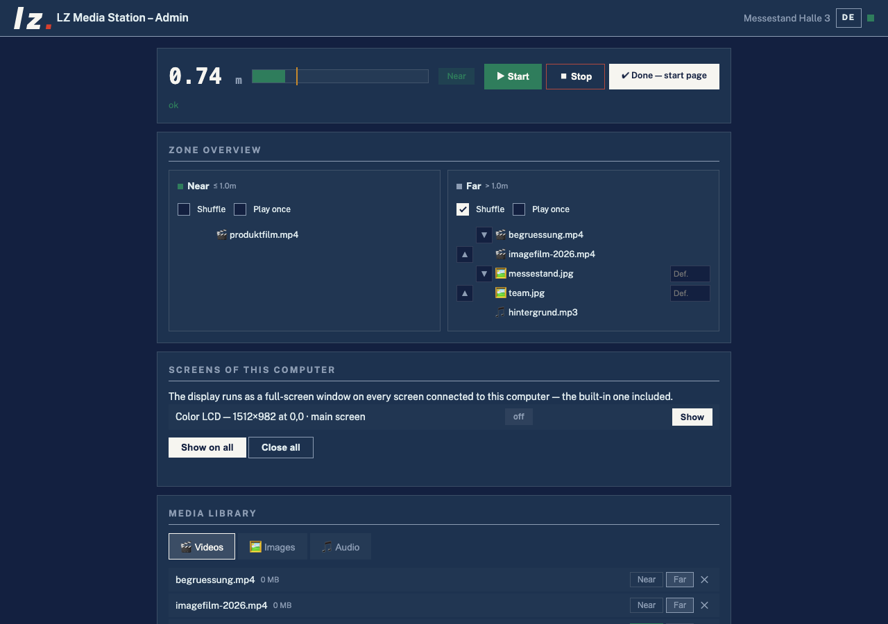
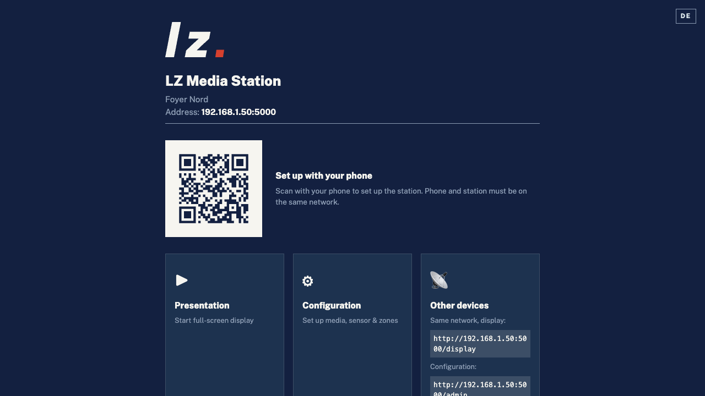
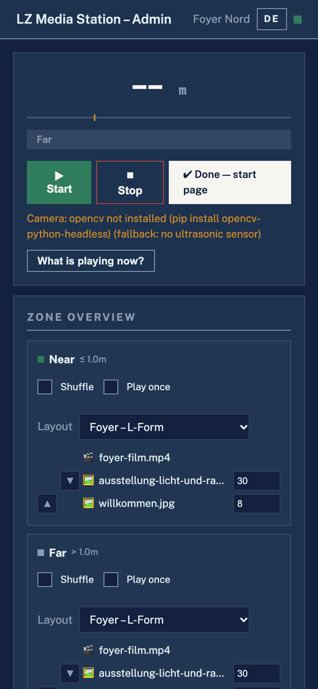
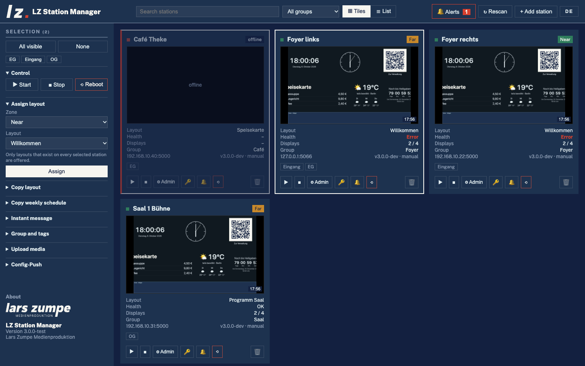

# LZ Media Station

[Deutsch](README.de.md) · **English**

> Sensor-driven media station with web admin, display mode and a multi-station manager.
> Runs on a **Raspberry Pi** (HC-SR04 ultrasonic sensor) and on **Mac/Windows** (camera detection as the distance source).
> Without a sensor the camera takes over on its own — `sensor_type: "auto"` is the default ([details](docs/sensoren.md), German).

[](https://github.com/larszu/lz-media-station/releases/latest)



| Start page | Admin on a phone | Station Manager |
|---|---|---|
|  |  |  |

**Project page:** https://larszu.github.io/lz-media-station/ — README and docs, rebuilt on every push to `main` (`.github/workflows/pages.yml`).

The detailed documentation in [`docs/`](docs/README.md) is written in German.

---
## Contents

- [Features](#features)
- [Running on your own computer](#running-on-your-own-computer--no-pi-needed)
- [Raspberry Pi quick start](#raspberry-pi-quick-start)
- [Manual deploy / update](#manual-deploy--update)
- [Usage](#usage)
- [Multi-Station Manager (desktop app)](#multi-station-manager-desktop-app)
- [Architecture](#architecture)
- [API overview](#api-overview)
- [Documentation](#documentation)
- [Troubleshooting](#troubleshooting)
- [Tailscale (remote management)](#tailscale-remote-management)
- [Appearance](#appearance)

---

## Features

### Layouts and instant publish (3.0)
- **Layouts with regions**: a layout divides the screen into percent
  rectangles; each media region plays its own **mixed playlist** (video,
  image, web page, audio) with cross-fades, a per-item duration and a
  **validity period** (`from`/`to`, filtered in the core). Templates: full
  screen, split, L-shape, ticker. Every zone plays one layout — see
  [`docs/architektur-v3.md`](docs/architektur-v3.md)
- **Instant publish**: `GET /api/events` (Server-Sent Events) pushes the new
  scene the moment it changes; polling is only the fallback
- **Commands to all displays** (`POST /api/befehl`): reload, show a layout
  for a while (announcement), screenshot (evaluation follows)
- **Preview**: `/display?vorschau=1&layout=<id>` renders a layout with the
  very page that runs on the screen — no sensor, no auto-start
- **The display never redirects to the admin any more**: a screen in a foyer
  stays black and says in one discreet line what is missing
- **Extension points**: `api_*.py` blueprints, `templates/admin/zusatz/`,
  `static/module/`, `static/anzeige/`, `static/i18n/` — wave 2 (layout editor,
  widgets, scheduling) only adds files

### Sensor and media core
- **Three selectable distance sources** (`sensor_type`):
  - **HC-SR04 ultrasonic sensor** on GPIO 23 (trigger) / GPIO 24 (echo) — freely configurable (default)
  - **Camera detection** via a webcam (OpenCV + YuNet/Haar) — also runs on **Mac and Windows**, see [`docs/sensoren.md`](docs/sensoren.md)
  - **Push button**: the visitor presses a button instead of being measured
- **No invented values**: with no sensor connected the station measures nothing and does not trigger — the interface says so in plain words instead of showing a made-up distance
- **Health check**: sensor without readings, full disk, zone without media, missing files — visible in the admin and via `/api/identity` for the Station Manager
- **Visitor statistics**: visits and dwell time per day/hour, CSV export — without storing anything about individual people, see [`docs/statistik-und-zustand.md`](docs/statistik-und-zustand.md)
- **Scheduling**: weekly plan with opening hours (also across midnight) — outside them the screen stays black, audio off and nothing triggers; optionally switch the TV off via HDMI-CEC, see [`docs/zeitsteuerung.md`](docs/zeitsteuerung.md)
- **Two or three zones**: NEAR / FAR, optionally with MID in between — with a configurable delay against flicker, see [`docs/zonen.md`](docs/zonen.md)
- **Per zone** any selection of videos, images and audio
- **Lockstep across stations**: one station follows another station's zone over the LAN — one sensor drives a whole wall, see [`docs/gleichtakt.md`](docs/gleichtakt.md)
- **Multiple languages**: subtitle tracks (WebVTT) per video with language buttons on the display, see [`docs/mehrsprachigkeit.md`](docs/mehrsprachigkeit.md)
- **Playlist options per zone**: shuffle, "play once", reordering and a custom duration per image, see [`docs/zonen.md`](docs/zonen.md)
- **Image slideshow** with adjustable interval
- **Volume** separately for master / video / audio (0–100 %)
- **Video resume**: optionally continue playback where it left off instead of from the start

### Web admin (`/admin`)
- **German and English**: the DE/EN button in the header switches the language; without a choice the browser language decides, `?lang=en` in the address fixes it (also for a kiosk). The Station Manager has the same switch
- Zone overview
- Media library with tabs (videos / images / audio)
- **Drag-and-drop upload** with progress and **media check** (warns about 4K/60 fps/foreign codecs that stutter on the Pi)
- **Backup**: export and restore the configuration — to clone a station or after an SD card failure, see [`docs/betrieb.md`](docs/betrieb.md)
- **Non-destructive** deletion: removes a file from the zones only, the file stays on the Pi
- Live status: distance, active zone, plain-language state of the distance source
- Settings: station name, threshold, delay, image interval, volumes, video resume

### System settings (own section in `/admin`)
- **Distance source**: ultrasonic (GPIO trigger/echo), camera (index, focal length) or push button (pin, hold time)
- **Lockstep**: assign another station as the clock source
- **Display IP** for remote control (empty = auto-detect)
- **Network** via `nmcli`:
  - DHCP / static IP
  - IP/CIDR, gateway, DNS directly configurable
- **Wi-Fi control**:
  - Wi-Fi on/off toggle
  - network scan with signal strength and encryption
  - pick an SSID, enter the password → connect
- **Pi reboot** straight from the UI

### Start page (`/`) and display (`/display`)
- `/` is a small menu linking to display and admin — **the kiosk opens this page at boot**
- `/display` is the full-screen player (Chromium `--kiosk`), with cross-fades, subtitle tracks and language buttons
- ESC opens `/admin` from either page
- The cursor hides itself on the display

### Manager desktop app (`station-manager/`)
- Manages **several Pi stations** centrally
- **Auto-discovery** via mDNS (`_lzstation._tcp` over Avahi)
- **Add manually** by IP/hostname
- Live polling: online state, distance, zone
- **Bulk actions**: start / stop / reboot
- **Bulk upload**: the same file to N stations at once
- **Config push**: station name, threshold, delay
- Jump straight into each station's web admin
- Builds for **Windows (NSIS + portable)**, **macOS (Intel + Apple Silicon)**, **Linux (AppImage)**

---

## Running on your own computer — no Pi needed

```bash
./run-local.sh          # Linux / macOS
run_windows.bat         # Windows (double-click)
run_windows.bat --server  # Windows, for a caller: foreground, no browser
```

All it needs is Python 3.10+. On the first run the script creates a `.venv`,
installs `requirements.txt` and starts the server.

**Without a sensor nothing is invented.** If `gpiozero` or a GPIO chip is
missing (i.e. on every development machine), the ultrasonic sensor measures
nothing: `distance` stays "unknown", nothing triggers, and the admin says in
plain words that no sensor is connected. To develop or exhibit on Mac/Windows
without ultrasonic hardware, switch **Distance source** in the admin to
**Camera** (webcam); setup is described in [`docs/sensoren.md`](docs/sensoren.md).

`start.sh` is something else: the **kiosk** start on the Pi. It waits for a
Wayland socket, kills `piwiz` and `zenity` and launches Chromium full-screen.
None of that works on a laptop.

### This computer is a media player too — on every screen

```bash
python3 main.py --list-displays     # what is connected?
python3 main.py --play-on all       # display on every screen
python3 main.py --play-on 0,2       # only on these two
```

The display is a browser page (`/display`). On the Pi a Chromium opens it in
kiosk mode; on a laptop or a computer at the stand the station opens its own
full-screen window on every connected screen — **the built-in one counts
too**.

The screens also appear in the web admin, with one button per screen. The card
only shows up when there is something to show: on a Pi without X an empty list
with two useless buttons would be worse than no card.

**They are found the way the system itself offers:**

| Windows | `ctypes` → `user32.EnumDisplayMonitors` (standard library) |
|---|---|
| macOS | `system_profiler SPDisplaysDataType -json` |
| Linux | `xrandr --listmonitors` |

No new dependency.

**Why a position and not "screen number 2".** There is no way to tell a
browser "go full-screen on screen 2". What there is, is a window at a
**position**: every screen has a corner in the shared coordinate system, and a
window opened there lands on that screen. That is exactly what
`--window-position` and `--window-size` do.

Two limits follow from this:

* If you **rearrange the screens in the system settings while a window is
  open**, it does not follow. Screens are enumerated when the window opens.
* macOS reports **no coordinates** in its output. The corners are therefore
  lined up from the widths: main screen at 0/0, the others to its right. If
  your screens are stacked vertically, the window opens in the wrong place —
  it still opens and can be moved.

**Chrome, Chromium or Edge.** Firefox and Safari cannot open a window on a
specific screen, so they are not on the list. If the station finds no browser,
it says **where it looked**.

Every screen gets its own browser profile. Without that the second one stays
black: a second Chrome call with the same profile folds into the existing
window instead of opening a new one.

`tests/test_displays.py` checks the parsing against real output from
`system_profiler` and `xrandr` — CI has no screen, and the question is a
different one anyway: whether the text yields the right corner — including
screens **left** of the main screen (`-1920+0`) and the refresh-rate suffix
of Apple Silicon Macs (`1512 x 982 @ 120.00Hz`).

### Other devices on the same network

The server binds to all interfaces, and **at startup it prints the address you
can actually type in**:

```
  LZ Media Station
    hier:            http://127.0.0.1:5000/
    im selben Netz:  http://192.168.1.42:5000/

    Anzeige (Schirm am Aufbau):   http://192.168.1.42:5000/display
    Verwaltung (Handy/Notebook):  http://192.168.1.42:5000/admin
```

The same addresses are shown on the station's start page.

Any number of devices can open `/display` at the same time — a second screen at
the stand, a tablet in the lobby. `/admin` is the management interface.

**`--host 127.0.0.1` locks this down** — useful on foreign networks (hotel
Wi-Fi, trade fair, customer network) where the admin would otherwise be open.
The default is `0.0.0.0`, because that is exactly what the station is for.

`tests/test_web_clients.py` connects via this machine's **LAN address**, not
`localhost` — the same path a phone takes — and also checks the opposite: does
`--host 127.0.0.1` really bind locally only?

## Raspberry Pi quick start

Fresh Pi (Raspberry Pi OS Bookworm, Wayland/labwc session, user `pi`):

```bash
curl -sSL https://raw.githubusercontent.com/larszu/lz-media-station/main/install_pi.sh | bash
```

The installer does the following:

1. System packages (`python3-flask`, `python3-gpiozero`, `chromium-browser`, `avahi-daemon`, `git`)
2. Clones the repo to `~/pi_media_station`
3. Creates media folders (`videos/`, `images/`, `audio/`, `subtitles/`)
4. Writes `~/.config/autostart/LZ_Media_Station.desktop`
5. Chromium policy: disables the translate banner
6. Suppresses disruptive login dialogs (`gnome-keyring*`)
7. **Sudoers rule** for `nmcli` and `reboot` (passwordless for `pi`)
8. **Avahi service** `_lzstation._tcp` for mDNS discovery by the manager

After installation:

```bash
~/pi_media_station/start.sh    # start now
# OR
sudo reboot                    # uses autostart
```

The web UI is then at `http://<pi-ip>:5000/admin`.

---

## Manual deploy / update

### First clone

```bash
git clone https://github.com/larszu/lz-media-station.git ~/pi_media_station
cd ~/pi_media_station
chmod +x start.sh install_pi.sh
bash install_pi.sh   # idempotent, detects an existing repo
```

### Update to the latest version

```bash
cd ~/pi_media_station
git pull
pkill -f 'python3 main.py' || true
nohup python3 main.py >/tmp/main.log 2>&1 &
```

or simply:

```bash
sudo reboot
```

### Single files via SCP (from a development PC)

```powershell
# Windows PowerShell
cd "c:\Users\<user>\Documents\LZ Media Station\pi_media_station"
scp web_ui.py templates/admin.html static/app.js pi@<pi-ip>:/tmp/
ssh pi@<pi-ip> "cp /tmp/web_ui.py ~/pi_media_station/web_ui.py && \
                cp /tmp/admin.html ~/pi_media_station/templates/ && \
                cp /tmp/app.js ~/pi_media_station/static/ && \
                pkill -f 'python3 main.py' || true; \
                sleep 2; cd ~/pi_media_station; \
                setsid nohup python3 main.py >/tmp/main.log 2>&1 < /dev/null &"
```

### Developing locally on Windows

```cmd
run_windows.bat
```

Starts Flask on `http://localhost:5000`. Without ultrasonic hardware the
station measures nothing; for a webcam switch **Distance source** in the admin
to **Camera** (see [`docs/sensoren.md`](docs/sensoren.md)).

---

## Usage

### Web admin (`/admin`)

| Section | Function |
|---|---|
| **Status** | Distance (or pressed/released for the button), zone, start/stop, plain-language state of the source |
| **Health** | Findings of the health check — dead sensor, full disk, missing files |
| **Statistics** | Visits today/total, daily curve, recent days, CSV download |
| **Backup** | Export and restore the configuration |
| **Zones** | Per zone: shuffle, "play once", order (▲▼), duration per image |
| **Library** | Upload (with media check), assign with one button per zone, delete from zones only |
| **Subtitles** | Define languages, upload `.vtt`, assign per video and language |
| **Settings** | Name, number of zones, thresholds, delay, image interval, volumes, video resume |
| **Scheduling** | Weekly plan, HDMI-CEC |
| **About** | Main logo, name, version |
| **System settings** | Distance source, lockstep, display IP, network, Wi-Fi, reboot |

A medium is assigned to a zone in the **library** with one button per zone;
the order is set in the **zone overview** with arrows — deliberately no
drag-and-drop: this page is used from a phone, and dragging with a thumb is
the least reliable way there.

### Display (`/display`)

- ESC → `/admin`
- At Pi boot the Chromium kiosk loads the **start page `/`** (see `start.sh`);
  from there it is one click to the display. A second device can also open
  `/display` directly.

### Configuring the network

In `/admin` → **System settings** → **Connection**:

1. Choose the active connection
2. **DHCP** or **static**
3. For static: IP/CIDR (e.g. `192.168.1.50/24`), gateway, DNS
4. **Apply network**

> The connection drops briefly — then enter the new IP in the browser.

### Configuring Wi-Fi

In `/admin` → **System settings** → **Wi-Fi**:

1. Enable the Wi-Fi toggle
2. **Scan networks**
3. Click an SSID → enter the password
4. **Connect to Wi-Fi**

> An active Ethernet connection stays up — you can put the Pi on Wi-Fi in parallel.

---

## Multi-Station Manager (desktop app)

`station-manager/` contains an Electron app for Windows/Mac/Linux.

### Development

```bash
cd station-manager
npm install
npm start
```

### Build (distributables)

```bash
npm run dist:win    # Windows: NSIS installer + portable .exe
npm run dist:mac    # macOS: DMG for Intel + Apple Silicon
npm run dist        # plus Linux AppImage
```

Artifacts end up in `station-manager/dist/`.

### Workflow

1. **Discovery**: every Pi on the LAN with the Avahi service appears automatically
2. **Add manually**: by IP when mDNS does not get through (e.g. via Tailscale)
3. **Select**: click cards → bulk actions become active
4. **Bulk**: start / stop / reboot, media upload, config push
5. **Open admin**: each card opens `/admin` in the system browser

The app's persistent data: `%APPDATA%\station-manager\stations.json` (Windows) or `~/Library/Application Support/station-manager/` (Mac).

---

## Architecture

```
                ┌─────────────────────────────┐
                │ LZ Station Manager (Electron)│
                │   Win / macOS / Linux       │
                └──────────────┬──────────────┘
                               │ HTTP/JSON (LAN or Tailscale)
        ┌──────────────────────┼──────────────────────┐
        │                      │                      │
   ┌────▼────┐            ┌────▼────┐            ┌────▼────┐
   │ Pi #1   │            │ Pi #2   │            │ Pi #N   │
   │ Flask   │            │ Flask   │            │ Flask   │
   │ + Avahi │            │ + Avahi │            │ + Avahi │
   │ HC-SR04 │            │ HC-SR04 │            │ HC-SR04 │
   └─────────┘            └─────────┘            └─────────┘
```

**Pi stack:** (playback happens in the browser, not in Python — there is no
player process.)

| Module | Purpose |
|---|---|
| `main.py` | Controller: zone state machine, weekly plan, statistics, scene events |
| `web_ui.py` | Flask routes (`/`, `/admin`, `/display`, `/api/*`), SSE, extension hooks |
| `config_schema.py` | Defaults **and** limits; repair on load, rejection on write |
| `layouts.py` | Layouts, regions, playlists (3.0): schema, migration of old zone lists, mirror into the zone, date filter |
| `api_layouts.py` | Blueprint for the layout routes (`/api/layouts`) — the pattern every `api_*.py` extension follows |
| `ereignisse.py` | Event bus for Server-Sent Events (pure, no Flask) |
| `VERSION` | The one source of the version (`/api/identity`, `/api/status`, `main.py --version`) |
| `sensor.py` | Base of all distance sources (averaging, staleness) + HC-SR04 |
| `camera_sensor.py` | Camera source (OpenCV + YuNet/Haar), cross-platform |
| `button_sensor.py` | Push-button source on GPIO |
| `auto_sensor.py` | Selection with fallback: HC-SR04, and if there is none, the camera |
| `sync.py` | Lockstep: follows another station's zone |
| `zeitplan.py` | Opening hours (pure, no clock — hence testable) |
| `statistik.py` | Count visits, evaluate, save atomically |
| `gesundheit.py` | Health check (pure, the situation is passed in) |
| `medien_check.py` | Assesses uploaded videos (ffprobe optional) |
| `tv_cec.py` | Switch the TV via HDMI-CEC (never throws) |
| `displays.py` | Find and drive this computer's screens |
| `static/`, `templates/` | Frontend (admin, display, start page); admin cards are includes in `templates/admin/` |
| `static/module/`, `static/anzeige/`, `static/i18n/`, `templates/admin/zusatz/` | Extension points — files there are picked up automatically |
| `static/i18n.js`, `static/i18n-en.js` | Interface language: German source, English dictionary; `tests/test_i18n.py` finds missing entries |
| `lzstation.service` | Avahi mDNS for manager discovery |

**Manager stack:**
- `main.js` – Electron main process, mDNS (`bonjour-service`), HTTP multipart upload
- `preload.js` – contextIsolation IPC bridge
- `renderer/` – UI

---

## API overview

All endpoints under `http://<pi-ip>:5000`.

### State and playback

| Method | Path | Description |
|---|---|---|
| GET | `/api/status` | Distance, zone, sensor state, quiet hours, IP, full config |
| GET | `/api/scene` | What to play right now: zone, **layout** with regions and playlists, volumes, subtitles. `?layout=<id>[&zone=&zeit=]` = preview of a layout |
| GET | `/api/events` | **Server-Sent Events**: `scene`, `config`, `befehl`; with `?status=1` also `status` every second |
| POST | `/api/befehl` | Command to all displays: `reload`, `zeige_layout` {layout_id, dauer_s}, `screenshot` |
| GET | `/api/sync` | **Clock for other stations**: zone + quiet hours only (see [lockstep](docs/gleichtakt.md)) |
| GET | `/api/health` | Health-check findings + overall level |
| GET | `/api/identity` | Station ID, name, version, health level (manager discovery) |
| POST | `/api/start` · `/api/stop` | Start / stop sensor control |

### Configuration

| Method | Path | Description |
|---|---|---|
| POST | `/api/config` | Write the configuration (**rejects** and names the field). Read it via `/api/status` |
| GET | `/api/backup` | Download the configuration as a JSON file |
| POST | `/api/restore` | Restore a backup (**repairs** instead of rejecting; old backups are migrated into layouts) |

### Layouts (3.0)

| Method | Path | Description |
|---|---|---|
| GET | `/api/layouts` | All layouts plus which zone plays which |
| GET | `/api/layouts/vorlagen` | Templates (`vollbild`, `geteilt`, `l-form`, `ticker`, `frei`) |
| POST | `/api/layouts` | Create `{name, vorlage?, id?}` — the id is derived from the name |
| GET/PUT/DELETE | `/api/layouts/<id>` | Read, replace (**rejects** and names the field), delete (409 while a zone plays it) |
| POST | `/api/layouts/<id>/duplizieren` | Copy `{name?, id?}` |

### Media

| Method | Path | Description |
|---|---|---|
| GET | `/api/media/<type>` | File list (`videos`, `images`, `audio`, `subtitles`) |
| POST | `/api/upload/<type>` | Multipart upload; for videos with a **media check** in the response |
| DELETE | `/api/media/<type>/<name>` | Remove from all zones (the file stays) |
| GET | `/media/<type>/<name>` | Serve the file |

### Statistics

| Method | Path | Description |
|---|---|---|
| GET | `/api/statistik` | Visits today/total, daily curve, recent days |
| GET | `/api/statistik.csv` | Daily values as CSV (semicolon, comma as decimal separator) |
| POST | `/api/statistik/reset` | Reset counters to zero |

### This computer and its system

| Method | Path | Description |
|---|---|---|
| GET | `/api/displays` | Screens connected to this computer |
| POST | `/api/displays/play` · `/api/displays/stop` | Open / close display windows |
| GET/POST | `/api/system/network` | nmcli IP configuration |
| GET/POST | `/api/system/wifi` | Wi-Fi on/off, scan, connect |
| POST | `/api/system/reboot` | `sudo reboot` |

---

## Documentation

This README is the overview. Topics that need more than a paragraph live in
[`docs/`](docs/README.md) (German) — the how and, more importantly, the
**why**.

| Document | Topic |
|---|---|
| [Distance sources](docs/sensoren.md) | Ultrasonic, camera, button; calibration; **comparison matrix** of common sensor types with a recommendation per use case |
| [Zones and playback](docs/zonen.md) | Two or three levels; shuffle, "play once", order, duration per image |
| [Scheduling](docs/zeitsteuerung.md) | Weekly plan (also across midnight), HDMI-CEC |
| [Statistics and health](docs/statistik-und-zustand.md) | Visitor numbers, CSV export, health check |
| [Multiple languages](docs/mehrsprachigkeit.md) | Subtitle tracks per video, language buttons |
| [Lockstep](docs/gleichtakt.md) | One station follows another station's zone |
| [Operation](docs/betrieb.md) | Media check on upload, backup and restore |
| [Architecture 3.0](docs/architektur-v3.md) | Layouts and regions, validity per item, SSE instead of polling, commands, preview, extension points |

**Two rules apply everywhere:** without a measurement nothing is invented — if
the sensor, the camera or the contact to the clock station is missing, there is
*no* value, the station does not trigger and says why in plain words. And all
defaults are backward compatible: after an update an existing installation
behaves exactly as before until someone switches something on.

---

## Troubleshooting

### Server not running after reboot

```bash
ssh pi@<pi-ip>
cat /tmp/main.log              # latest errors
ps -ef | grep main.py          # is the process running?
~/pi_media_station/start.sh    # start manually
```

### Manager does not find the Pi

- Check Avahi: `systemctl status avahi-daemon`
- Service registered? `ls /etc/avahi/services/lzstation.service`
- Fallback: add it manually by IP
- Firewall: is port 5000 open?

### nmcli asks for a password

The sudoers rule is missing:
```bash
cat /etc/sudoers.d/lz-media-station
# Should contain:
# pi ALL=(ALL) NOPASSWD: /usr/bin/nmcli, /sbin/reboot, /usr/sbin/reboot
```
Recreate it with `bash install_pi.sh`.

### Display shows a black screen

- Wayland env? `echo $WAYLAND_DISPLAY`
- `start.sh` sets `XDG_RUNTIME_DIR=/run/user/1000` and `WAYLAND_DISPLAY=wayland-0`
- Chromium log: `tail /tmp/chromium.log`

### Status shows 127.0.0.1 instead of the LAN IP

- Set the display IP manually in the system settings, OR
- Default route missing → check with `ip route`, set a gateway if needed

### Background start over SSH kills the server on logout

Always use `setsid` instead of `nohup ... &`:
```bash
setsid nohup python3 main.py >/tmp/main.log 2>&1 < /dev/null &
```

---

## Tailscale (remote management)

For multiple sites or managing from home:

```bash
# On every Pi
curl -fsSL https://tailscale.com/install.sh | sh
sudo tailscale up
```

Install Tailscale on the manager computer as well and sign in to the same tailnet. The Pis are then reachable at `100.x.y.z` or `<pi-name>.<tailnet>.ts.net` (MagicDNS).

> mDNS does **not** work over Tailscale → add stations once manually in the manager with their Tailscale address.

---

## Appearance

All interfaces follow Brand Guide 2.0 of Lars Zumpe Medienproduktion: Deep Navy as the background, Off-White for action surfaces, Tally Red only for the focus ring and the dot in the signet, no rounded corners, shadows or gradients. `tests/test_brand_tokens.py` checks this.

| File | Purpose |
|---|---|
| `static/brand/` | Favicon, app icon (192/512, Apple Touch), signet "lz.", main logo and word mark as outlines — web admin, start page, display, project page |
| `static/manifest.webmanifest` | Name and icons when the admin is added to a phone's home screen |
| `station-manager/build/` | App icon of the Station Manager (`icon.png`, `icon.ico`) for electron-builder |
| `station-manager/renderer/brand/` | Signet, main logo and window icon of the desktop app |

The Pi's desktop entries (`install_pi.sh`, `LZ_Media_Station.desktop`) use `static/brand/icon-512.png`. Below 640 px width the signet drops out of the header.

---

## License

Proprietary — © 2026 Lars Zumpe, all rights reserved. Using the published builds is free of charge; redistribution and derivative works are not. See [LICENSE](LICENSE).
