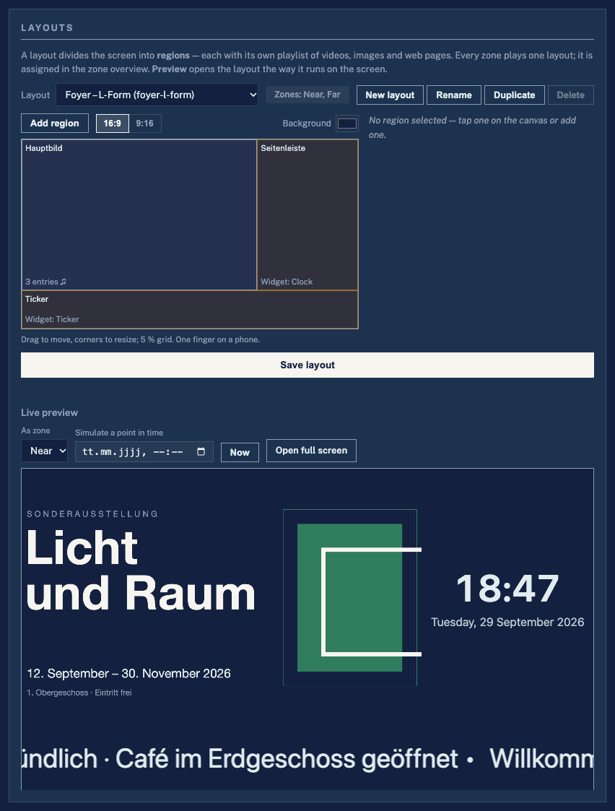
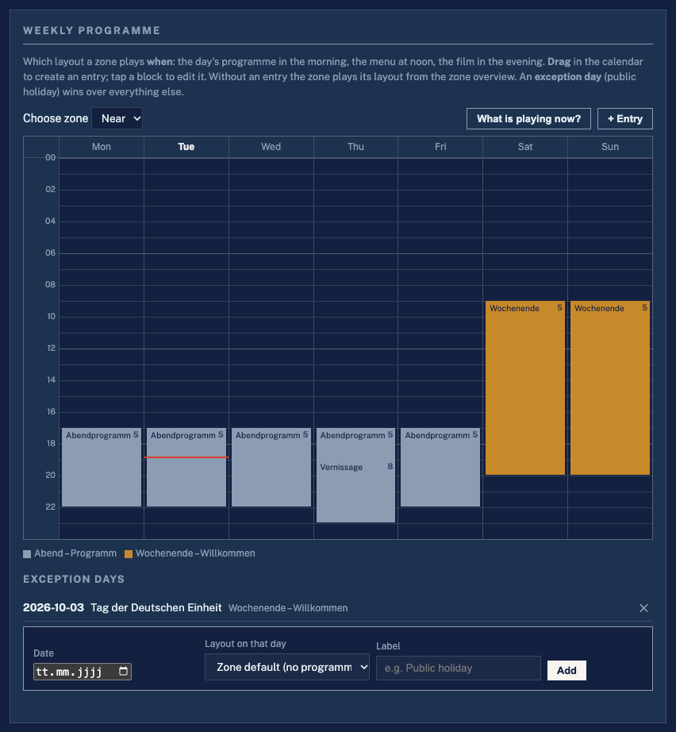
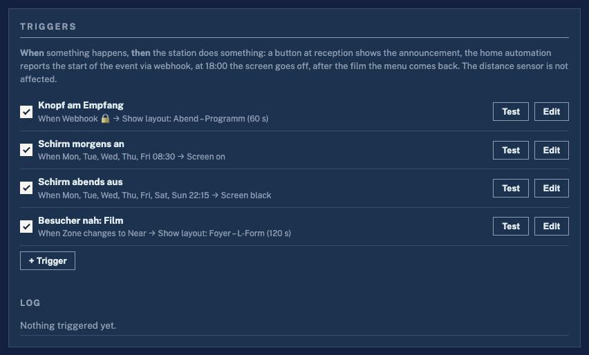
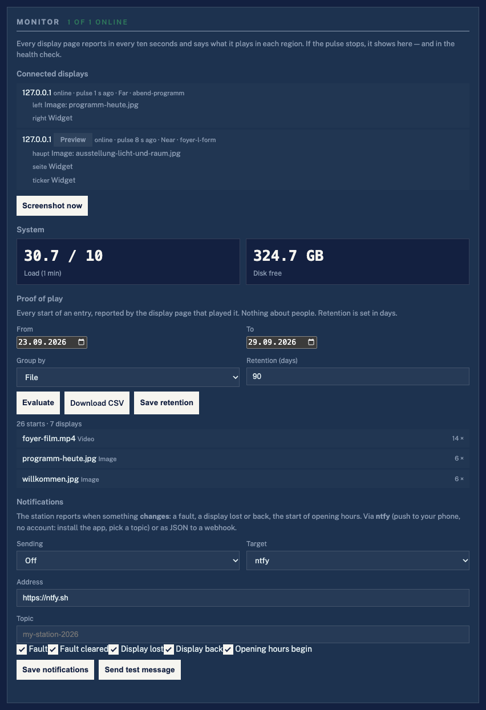

# LZ Media Station

[Deutsch](README.de.md) · **English**

> **Digital signage that reacts to people.** Layouts with regions, a weekly
> programme, widgets and instant messages — driven by a distance sensor, a
> button, a webhook or the clock. Runs on a **Raspberry Pi** and on any
> **Mac/Windows** computer, fully offline, with a desktop manager for many
> stations.

[](https://github.com/larszu/lz-media-station/releases/latest)


| Layout editor with live preview | Weekly programme | Triggers |
|---|---|---|
|  |  |  |

| Start page with QR code | Admin on a phone | Monitor | Station Manager |
|---|---|---|---|
|  |  |  |  |

**Project page:** https://larszu.github.io/lz-media-station/ — README and docs, rebuilt on every push to `main` (`.github/workflows/pages.yml`).
The detailed documentation in [`docs/`](docs/README.md) — including the
step-by-step [user manual](docs/handbuch.md) — is written in German.

---
## Contents

- [Why this and not BrightSign, Crestron, Xibo or Yodeck?](#why-this-and-not-brightsign-crestron-xibo-or-yodeck)
- [Quick start](#quick-start)
- [Features](#features)
- [Upgrade from 2.x](#upgrade-from-2x)
- [Running on your own computer](#running-on-your-own-computer--no-pi-needed)
- [Raspberry Pi quick start](#raspberry-pi-quick-start)
- [Manual deploy / update](#manual-deploy--update)
- [Usage](#usage)
- [Multi-Station Manager (desktop app)](#multi-station-manager-desktop-app)
- [Architecture](#architecture)
- [API overview](#api-overview)
- [Documentation](#documentation)
- [Troubleshooting](#troubleshooting)
- [Tailscale (remote management)](#tailscale-remote-management)
- [Appearance](#appearance)

---

## Why this and not BrightSign, Crestron, Xibo or Yodeck?

The established systems are good at playing content on a schedule. Where
users most often complain — per-screen fees, cloud lock-in, clumsy layout
and schedule editors, no real preview, slow publishing — this station takes
a different route:

| | LZ Media Station | Typical signage system |
|---|---|---|
| **Cost** | No licence per screen, no subscription | Fee per screen and month (cloud) or player hardware plus a CMS licence |
| **Offline** | Everything runs on the station; network only for widgets that fetch feeds | Cloud account required, or a local cache that syncs from the cloud |
| **Reacting to people** | Distance sensor (ultrasonic or camera), button, webhook, time, video ended, zone change — built in | Usually a schedule only; interaction via scripts (BrightSign) or an occupancy sensor that only switches on/off (Crestron) |
| **Preview** | The layout runs in the very page the screen uses, at a simulated point in time | Screenshot of the player or no preview |
| **Publishing** | Instant: the display gets the change via Server-Sent Events | Publish/sync step that can take minutes |
| **Hardware** | A Raspberry Pi or any computer with a browser — every connected screen counts | Dedicated player per screen |
| **Setup** | Scan the QR code on the start page, three steps to the first content | Installer or IT project |

What it deliberately does **not** do (yet): frame-accurate video walls,
automatic transcoding, PDF/PowerPoint import — see the
[issues](https://github.com/larszu/lz-media-station/issues).

---

## Quick start

```bash
./run-local.sh              # Linux / macOS — or run_windows.bat on Windows
```

1. The start page (`http://localhost:5000/`) shows a **QR code** — scan it
   with your phone, or click **Configuration**.
2. The admin shows **"First content in 3 steps"**: upload media → pick a
   layout template → assign it to a zone.
3. Open **Presentation** (`/display`) on the screen. Done.

On a Raspberry Pi, `install_pi.sh` sets up the service and the kiosk — see
[Raspberry Pi quick start](#raspberry-pi-quick-start).

---

## Features

### Content: layouts, playlists, widgets
- **Layouts with regions**: a layout divides the screen into percent
  rectangles (templates: full screen, split, L-shape, ticker, free); each
  media region plays its own **mixed playlist** — video, image, web page,
  audio — with cross-fades, a duration per entry and a **validity period**
  (`from`/`to`, filtered in the core, so expired content never reaches the
  screen) — see [`docs/layouts.md`](docs/layouts.md)
- **Layout editor with live preview**: draw regions on a canvas (drag,
  resize at the corners, 5 % grid — mouse and one finger on a phone), build
  playlists from the library, configure widgets from a catalogue; next to it
  the layout runs in the page the screen uses, at a **simulated point in
  time** ("show me Tuesday 18:00"), and **"What is playing now?"** shows the
  real scene muted
- **Widgets** in any region: clock (digital/analogue), text slide with
  templates (welcome, signpost, menu, notice, opening hours from the
  schedule), ticker, weather (Open-Meteo, no key), news (RSS/Atom), calendar
  (ICS, also as room occupancy), QR code (built in, offline), web page with
  embed check, countdown, and **your own HTML widgets** from `widgets/<name>/`.
  Feeds and weather go through the core (`/api/widgets/*`, cached); without
  network the last state stays on screen — see [`docs/widgets.md`](docs/widgets.md)
- **Instant publish**: `GET /api/events` (Server-Sent Events) pushes a new
  scene the moment it changes; polling is only the fallback
- **Unattended display**: a screen in a foyer never jumps to the admin; if
  something is missing it stays black and says so in one discreet line, and
  it keeps playing the last scene when the station is briefly unreachable

### Timing and events
- **Weekly programme**: which layout a zone plays **when** — a calendar
  (Mon–Sun × 24 h), drag to create an entry, priorities, entries across
  midnight, exception days (public holidays), "what is playing now" — see
  [`docs/programm.md`](docs/programm.md)
- **Opening hours**: outside them the screen stays black, audio off and
  nothing triggers; optionally the TV switches off via HDMI-CEC — see
  [`docs/zeitsteuerung.md`](docs/zeitsteuerung.md)
- **Instant message**: one message over everything, on every screen, at once
  — evacuation, notice, break; with duration and alert tone; survives a
  display reload
- **Triggers** (when … then …): webhook (Home Assistant, Node-RED, ioBroker),
  GPIO button, time of day, video ended, zone change → show a layout, instant
  message, screen black/on (+ HDMI-CEC), start/stop — with a test button and a
  log, see [`docs/ausloeser.md`](docs/ausloeser.md)
- **Commands to all displays** (`POST /api/befehl`): reload, show a layout
  for a while, screenshot

### Reacting to visitors
- **Three selectable distance sources** (`sensor_type`):
  - **HC-SR04 ultrasonic sensor** on GPIO 23 (trigger) / GPIO 24 (echo) — freely configurable
  - **Camera detection** via a webcam (OpenCV + YuNet/Haar) — also runs on **Mac and Windows**, see [`docs/sensoren.md`](docs/sensoren.md)
  - **Push button**: the visitor presses a button instead of being measured
  - `auto` (the default) picks what is there: without a sensor the camera takes over
- **Two or three zones**: NEAR / FAR, optionally MID in between — each zone plays its own layout, with a configurable delay against flicker, see [`docs/zonen.md`](docs/zonen.md)
- **No invented values**: with no sensor connected the station measures nothing and does not trigger — the interface says so in plain words instead of showing a made-up distance
- **Lockstep across stations**: one station follows another station's zone over the LAN — one sensor drives a whole wall, see [`docs/gleichtakt.md`](docs/gleichtakt.md)
- **Multiple languages**: subtitle tracks (WebVTT) per video with language buttons on the display, see [`docs/mehrsprachigkeit.md`](docs/mehrsprachigkeit.md)
- **Playback options per region**: shuffle, "play once", order, duration per image, video resume; volume separately for master / video / audio

### Operation and monitoring
- **Monitoring**: every display page reports every 10 s what it plays in each
  region; the admin shows connected displays, a **screenshot on demand**
  (real screen via `grim`/`scrot` on the Pi, otherwise rendered by the page),
  CPU temperature, load, RAM — see [`docs/monitoring.md`](docs/monitoring.md)
- **Proof of play**: every start of an entry lands in a SQLite file; summary
  per file/day/hour/layout and CSV export, retention configurable
- **Notifications**: ntfy (push to your phone) or webhook on a **change** —
  fault, display lost or back, start of opening hours
- **Health check**: sensor without readings, full disk, zone without content, missing files, no display connected — in the admin and via `/api/identity` for the Station Manager
- **Visitor statistics**: visits and dwell time per day/hour, CSV export — without storing anything about individual people, see [`docs/statistik-und-zustand.md`](docs/statistik-und-zustand.md)
- **Access protection**: an optional PIN in front of the admin; write calls
  need the session or the `X-LZ-Pin` header (the Station Manager sends it),
  the display and the kiosk itself stay free — see [`docs/zugang.md`](docs/zugang.md)
- **Backup**: export and restore the configuration — to clone a station or after an SD card failure; backups from 2.x restore too, see [`docs/betrieb.md`](docs/betrieb.md)

### Web admin (`/admin`)
- **German and English**: the DE/EN button in the header switches the language; without a choice the browser language decides, `?lang=en` in the address fixes it (also for a kiosk). The Station Manager has the same switch
- **First content in 3 steps**: an empty station shows a short guide at the top (upload → layout → zone) that disappears with the first content
- Zone overview with a layout per zone
- Media library with tabs (videos / images / audio), **drag-and-drop upload** with progress and **media check** (warns about 4K/60 fps/foreign codecs that stutter on the Pi)
- **Non-destructive** deletion: removes a file from the zones only, the file stays on the station
- Live status: distance, active zone, plain-language state of the distance source
- Works on a phone (one column below 640 px)

### System settings (own section in `/admin`)
- **Distance source**: ultrasonic (GPIO trigger/echo), camera (index, focal length) or push button (pin, hold time)
- **Lockstep**: assign another station as the clock source
- **Display IP** for remote control (empty = auto-detect)
- **Network** via `nmcli`: DHCP / static IP, IP/CIDR, gateway, DNS
- **Wi-Fi control**: on/off, network scan with signal strength and encryption, pick an SSID, enter the password → connect
- **Reboot** straight from the UI

### Start page (`/`) and display (`/display`)
- `/` is a small menu linking to display and admin, with a **QR code** to the admin for setting up from a phone — **the kiosk opens this page at boot** and starts the display after 15 s once there is content
- `/display` is the full-screen player (Chromium `--kiosk`), with regions, cross-fades, widgets, subtitle tracks and language buttons
- ESC opens `/admin` from either page; the cursor hides itself on the display

### Manager desktop app (`station-manager/`)
- Manages **many stations** centrally: **auto-discovery** via mDNS (`_lzstation._tcp` over Avahi) or added by IP/hostname
- **Tiles or list** per station: zone, active layout, health, displays online, last screenshot as preview (click = request a fresh one), version
- **Search, groups and tags**: groups and tags live in the Manager only; filter by group or tag
- **Bulk actions on the selection**, with a result per station: assign a layout to a zone, copy a layout to other stations (with a list of missing media), copy the weekly schedule (missing layouts are reported first), instant message on/off, start / stop / reboot, the same file to N stations, config push
- **Alerts**: polled every 10 s; a station going offline, health turning to *error* or a display dropping out raises a system notification and an entry in the alert list — mutable per station
- **Admin embedded**: each station's `/admin` opens inside the Manager; "Open in browser" stays available
- **PIN**: stations with an admin PIN are asked for it once; the Manager sends it as `X-LZ-Pin`
- Builds for **Windows (NSIS + portable)**, **macOS (Intel + Apple Silicon)**, **Linux (AppImage)**

### Extending it
- `api_*.py` blueprints, `templates/admin/zusatz/`, `static/module/`,
  `static/anzeige/`, `static/i18n/` — a new feature is a set of new files,
  not a change to the core; see [`docs/architektur-v3.md`](docs/architektur-v3.md)

---

## Upgrade from 2.x

Nothing to do by hand. On the first start 3.0 moves each zone's videos and
images into a layout `zone-near` / `zone-mid` / `zone-far` with one
full-screen region, keeping order, shuffle, "play once" and the duration per
image; the zones keep playing exactly what they played before. Backups made
with 2.x restore into 3.0 the same way, and a 2.x Station Manager can still
push media and settings. All new functions — programme, triggers, widgets,
PIN, notifications — are off until someone switches them on.

What changed in detail: [`docs/aenderungen-3.0.md`](docs/aenderungen-3.0.md) (German).

---

## Running on your own computer — no Pi needed

```bash
./run-local.sh          # Linux / macOS
run_windows.bat         # Windows (double-click)
run_windows.bat --server  # Windows, for a caller: foreground, no browser
```

All it needs is Python 3.10+. On the first run the script creates a `.venv`,
installs `requirements.txt` and starts the server.

**Without a sensor nothing is invented.** If `gpiozero` or a GPIO chip is
missing (i.e. on every development machine), the ultrasonic sensor measures
nothing: `distance` stays "unknown", nothing triggers, and the admin says in
plain words that no sensor is connected. To develop or exhibit on Mac/Windows
without ultrasonic hardware, switch **Distance source** in the admin to
**Camera** (webcam); setup is described in [`docs/sensoren.md`](docs/sensoren.md).

`start.sh` is something else: the **kiosk** start on the Pi. It waits for a
Wayland socket, kills `piwiz` and `zenity` and launches Chromium full-screen.
None of that works on a laptop.

### This computer is a media player too — on every screen

```bash
python3 main.py --list-displays     # what is connected?
python3 main.py --play-on all       # display on every screen
python3 main.py --play-on 0,2       # only on these two
```

The display is a browser page (`/display`). On the Pi a Chromium opens it in
kiosk mode; on a laptop or a computer at the stand the station opens its own
full-screen window on every connected screen — **the built-in one counts
too**.

The screens also appear in the web admin, with one button per screen. The card
only shows up when there is something to show: on a Pi without X an empty list
with two useless buttons would be worse than no card.

**They are found the way the system itself offers:**

| Windows | `ctypes` → `user32.EnumDisplayMonitors` (standard library) |
|---|---|
| macOS | `system_profiler SPDisplaysDataType -json` |
| Linux | `xrandr --listmonitors` |

No new dependency.

**Why a position and not "screen number 2".** There is no way to tell a
browser "go full-screen on screen 2". What there is, is a window at a
**position**: every screen has a corner in the shared coordinate system, and a
window opened there lands on that screen. That is exactly what
`--window-position` and `--window-size` do.

Two limits follow from this:

* If you **rearrange the screens in the system settings while a window is
  open**, it does not follow. Screens are enumerated when the window opens.
* macOS reports **no coordinates** in its output. The corners are therefore
  lined up from the widths: main screen at 0/0, the others to its right. If
  your screens are stacked vertically, the window opens in the wrong place —
  it still opens and can be moved.

**Chrome, Chromium or Edge.** Firefox and Safari cannot open a window on a
specific screen, so they are not on the list. If the station finds no browser,
it says **where it looked**.

Every screen gets its own browser profile. Without that the second one stays
black: a second Chrome call with the same profile folds into the existing
window instead of opening a new one.

`tests/test_displays.py` checks the parsing against real output from
`system_profiler` and `xrandr` — CI has no screen, and the question is a
different one anyway: whether the text yields the right corner — including
screens **left** of the main screen (`-1920+0`) and the refresh-rate suffix
of Apple Silicon Macs (`1512 x 982 @ 120.00Hz`).

### Other devices on the same network

The server binds to all interfaces, and **at startup it prints the address you
can actually type in**:

```
  LZ Media Station
    hier:            http://127.0.0.1:5000/
    im selben Netz:  http://192.168.1.42:5000/

    Anzeige (Schirm am Aufbau):   http://192.168.1.42:5000/display
    Verwaltung (Handy/Notebook):  http://192.168.1.42:5000/admin
```

The same addresses are shown on the station's start page.

Any number of devices can open `/display` at the same time — a second screen at
the stand, a tablet in the lobby. `/admin` is the management interface.

**`--host 127.0.0.1` locks this down** — useful on foreign networks (hotel
Wi-Fi, trade fair, customer network) where the admin would otherwise be open.
The default is `0.0.0.0`, because that is exactly what the station is for.

`tests/test_web_clients.py` connects via this machine's **LAN address**, not
`localhost` — the same path a phone takes — and also checks the opposite: does
`--host 127.0.0.1` really bind locally only?

## Raspberry Pi quick start

Fresh Pi (Raspberry Pi OS Bookworm, Wayland/labwc session, user `pi`):

```bash
curl -sSL https://raw.githubusercontent.com/larszu/lz-media-station/main/install_pi.sh | bash
```

The installer does the following:

1. System packages (`python3-flask`, `python3-gpiozero`, `chromium-browser`, `avahi-daemon`, `git`)
2. Clones the repo to `~/lz-media-station`
3. Creates media folders (`videos/`, `images/`, `audio/`, `subtitles/`)
4. Writes `~/.config/autostart/LZ_Media_Station.desktop`
5. Chromium policy: disables the translate banner
6. Suppresses disruptive login dialogs (`gnome-keyring*`)
7. **Sudoers rule** for `nmcli` and `reboot` (passwordless for `pi`)
8. **Avahi service** `_lzstation._tcp` for mDNS discovery by the manager

After installation:

```bash
~/lz-media-station/start.sh    # start now
# OR
sudo reboot                    # uses autostart
```

The web UI is then at `http://<pi-ip>:5000/admin`.

---

## Manual deploy / update

### First clone

```bash
git clone https://github.com/larszu/lz-media-station.git ~/lz-media-station
cd ~/lz-media-station
chmod +x start.sh install_pi.sh
bash install_pi.sh   # idempotent, detects an existing repo
```

### Update to the latest version

On a Pi still installed under `~/pi_media_station`, `bash install_pi.sh` moves it — media and configuration included — to `~/lz-media-station` and rewrites the autostart entry.

```bash
cd ~/lz-media-station
git pull
pkill -f 'python3 main.py' || true
nohup python3 main.py >/tmp/main.log 2>&1 &
```

or simply:

```bash
sudo reboot
```

### Single files via SCP (from a development PC)

```powershell
# Windows PowerShell
cd "c:\Users\<user>\Documents\LZ Media Station\lz-media-station"
scp web_ui.py templates/admin.html static/app.js pi@<pi-ip>:/tmp/
ssh pi@<pi-ip> "cp /tmp/web_ui.py ~/lz-media-station/web_ui.py && \
                cp /tmp/admin.html ~/lz-media-station/templates/ && \
                cp /tmp/app.js ~/lz-media-station/static/ && \
                pkill -f 'python3 main.py' || true; \
                sleep 2; cd ~/lz-media-station; \
                setsid nohup python3 main.py >/tmp/main.log 2>&1 < /dev/null &"
```

### Developing locally on Windows

```cmd
run_windows.bat
```

Starts Flask on `http://localhost:5000`. Without ultrasonic hardware the
station measures nothing; for a webcam switch **Distance source** in the admin
to **Camera** (see [`docs/sensoren.md`](docs/sensoren.md)).

---

## Usage

### Web admin (`/admin`)

| Section | Function |
|---|---|
| **Status** | Distance (or pressed/released for the button), zone, start/stop, plain-language state of the source |
| **Health** | Findings of the health check — dead sensor, full disk, missing files |
| **Statistics** | Visits today/total, daily curve, recent days, CSV download |
| **Backup** | Export and restore the configuration |
| **Zones** | Per zone: shuffle, "play once", order (▲▼), duration per image |
| **Library** | Upload (with media check), assign with one button per zone, delete from zones only |
| **Subtitles** | Define languages, upload `.vtt`, assign per video and language |
| **Settings** | Name, number of zones, thresholds, delay, image interval, volumes, video resume |
| **Scheduling** | Weekly plan, HDMI-CEC |
| **About** | Main logo, name, version |
| **System settings** | Distance source, lockstep, display IP, network, Wi-Fi, reboot |

A medium is assigned to a zone in the **library** with one button per zone;
the order is set in the **zone overview** with arrows — deliberately no
drag-and-drop: this page is used from a phone, and dragging with a thumb is
the least reliable way there.

### Display (`/display`)

- ESC → `/admin`
- At Pi boot the Chromium kiosk loads the **start page `/`** (see `start.sh`);
  from there it is one click to the display. A second device can also open
  `/display` directly.

### Configuring the network

In `/admin` → **System settings** → **Connection**:

1. Choose the active connection
2. **DHCP** or **static**
3. For static: IP/CIDR (e.g. `192.168.1.50/24`), gateway, DNS
4. **Apply network**

> The connection drops briefly — then enter the new IP in the browser.

### Configuring Wi-Fi

In `/admin` → **System settings** → **Wi-Fi**:

1. Enable the Wi-Fi toggle
2. **Scan networks**
3. Click an SSID → enter the password
4. **Connect to Wi-Fi**

> An active Ethernet connection stays up — you can put the Pi on Wi-Fi in parallel.

---

## Multi-Station Manager (desktop app)

`station-manager/` contains an Electron app for Windows/Mac/Linux.

### Development

```bash
cd station-manager
npm install
npm start
```

### Build (distributables)

```bash
npm run dist:win    # Windows: NSIS installer + portable .exe
npm run dist:mac    # macOS: DMG for Intel + Apple Silicon
npm run dist        # plus Linux AppImage
```

Artifacts end up in `station-manager/dist/`.

### Workflow

1. **Discovery**: every Pi on the LAN with the Avahi service appears automatically
2. **Add manually**: by IP when mDNS does not get through (e.g. via Tailscale)
3. **Organise**: give stations a group and tags (sidebar, "Group and tags"); filter at the top
4. **Select**: click tiles, or "All visible" for everything the filter shows
5. **Act**: assign or copy a layout, copy the weekly schedule, send an instant message, start / stop / reboot, upload, push config — the result list shows each station's outcome
6. **Watch**: red tiles and the alert counter show what needs attention; the bell on a tile mutes that station
7. **Admin**: "Admin" on a tile opens `/admin` inside the Manager

The installed app keeps its data (`stations.json`, `pins.json`, `gruppen.json`) in `%APPDATA%\LZ Station Manager\` (Windows) or `~/Library/Application Support/LZ Station Manager/` (Mac); started from source (`npm start`) the folder is `station-manager`.

---

## Architecture

```
                ┌─────────────────────────────┐
                │  LZ Media Station Manager   │
                │  Electron · Win/macOS/Linux │
                └──────────────┬──────────────┘
                               │ HTTP/JSON (LAN or Tailscale)
        ┌──────────────────────┼──────────────────────┐
        │                      │                      │
   ┌────▼────┐            ┌────▼────┐            ┌────▼────┐
   │ Pi #1   │            │ Pi #2   │            │ Pi #N   │
   │ Flask   │            │ Flask   │            │ Flask   │
   │ + Avahi │            │ + Avahi │            │ + Avahi │
   │ HC-SR04 │            │ HC-SR04 │            │ HC-SR04 │
   └─────────┘            └─────────┘            └─────────┘
```

**Pi stack:** (playback happens in the browser, not in Python — there is no
player process.)

| Module | Purpose |
|---|---|
| `main.py` | Controller: zone state machine, weekly plan, statistics, scene events |
| `web_ui.py` | Flask routes (`/`, `/admin`, `/display`, `/api/*`), SSE, extension hooks |
| `config_schema.py` | Defaults **and** limits; repair on load, rejection on write |
| `layouts.py` | Layouts, regions, playlists (3.0): schema, migration of old zone lists, mirror into the zone, date filter |
| `api_layouts.py` | Blueprint for the layout routes (`/api/layouts`) — the pattern every `api_*.py` extension follows |
| `widgets.py` | Widget back end (3.0): fetch with cache, RSS/Atom and ICS parsers (standard library only), Open-Meteo, embed check, custom widget folders |
| `api_widgets.py` | Blueprint for the widget proxies (`/api/widgets/*`) and custom widget files (`/widgets/<name>/<path>`) |
| `ereignisse.py` | Event bus for Server-Sent Events (pure, no Flask) |
| `api_anzeige.py` | Pulse of the display pages, screenshot on demand, notification settings (`/api/anzeige/*`, `/api/benachrichtigung/*`) |
| `wiedergabe_log.py` | Proof of play: SQLite log of every started entry, dedup, retention, CSV |
| `api_wiedergabe.py` | Blueprint for the proof-of-play routes (`/api/wiedergabe/*`) |
| `benachrichtigung.py` | Notifier: reports **changes** (fault, display lost/back, opening hours) via ntfy or webhook; pure decision, sending separate |
| `zugang.py` | Access protection: PIN hash (PBKDF2), rate limit, the pure decision `entscheide()` — the PIN lives in `zugang.json`, not in the config |
| `api_zugang.py` | Login page, `/api/zugang/*`, the `before_request` gatekeeper |
| `programm.py` | Weekly programme (which layout when, priorities, exception days) and instant message — pure, the time is passed in |
| `api_programm.py` | Blueprint: `/api/programm`, `/api/meldung`; hooks the programme rule into the controller |
| `ausloeser.py` | Triggers: sources (webhook, button, time, video ended, zone) and actions; own thread, GPIO buttons, log |
| `api_ausloeser.py` | Blueprint: `/api/ausloeser`, `/api/trigger/<id>` (webhook) |
| `VERSION` | The one source of the version (`/api/identity`, `/api/status`, `main.py --version`) |
| `sensor.py` | Base of all distance sources (averaging, staleness) + HC-SR04 |
| `camera_sensor.py` | Camera source (OpenCV + YuNet/Haar), cross-platform |
| `button_sensor.py` | Push-button source on GPIO |
| `auto_sensor.py` | Selection with fallback: HC-SR04, and if there is none, the camera |
| `sync.py` | Lockstep: follows another station's zone |
| `zeitplan.py` | Opening hours (pure, no clock — hence testable) |
| `statistik.py` | Count visits, evaluate, save atomically |
| `gesundheit.py` | Health check (pure, the situation is passed in) |
| `medien_check.py` | Assesses uploaded videos (ffprobe optional) |
| `tv_cec.py` | Switch the TV via HDMI-CEC (never throws) |
| `displays.py` | Find and drive this computer's screens |
| `static/`, `templates/` | Frontend (admin, display, start page); admin cards are includes in `templates/admin/` |
| `static/module/`, `static/anzeige/`, `static/i18n/`, `templates/admin/zusatz/` | Extension points — files there are picked up automatically |
| `static/anzeige/widgets.js`, `widgets/` | The widgets of the display (`window.LZ_WIDGETS`, incl. QR encoder) and the folder for custom HTML widgets |
| `static/i18n.js`, `static/i18n-en.js` | Interface language: German source, English dictionary; `tests/test_i18n.py` finds missing entries |
| `lzstation.service` | Avahi mDNS for manager discovery |

**Manager stack:**
- `main.js` – Electron main process, mDNS (`bonjour-service`), HTTP multipart upload
- `preload.js` – contextIsolation IPC bridge
- `renderer/` – UI

---

## API overview

All endpoints under `http://<pi-ip>:5000`.

### State and playback

| Method | Path | Description |
|---|---|---|
| GET | `/api/status` | Distance, zone, sensor state, quiet hours, IP, full config |
| GET | `/api/scene` | What to play right now: zone, **layout** with regions and playlists, volumes, subtitles. `?layout=<id>[&zone=&zeit=]` = preview of a layout |
| GET | `/api/events` | **Server-Sent Events**: `scene`, `config`, `befehl`; with `?status=1` also `status` every second |
| POST | `/api/befehl` | Command to all displays: `reload`, `zeige_layout` {layout_id, dauer_s}, `screenshot` |
| GET | `/api/sync` | **Clock for other stations**: zone + quiet hours only (see [lockstep](docs/gleichtakt.md)) |
| GET | `/api/health` | Health-check findings + overall level |
| GET | `/api/identity` | Station ID, name, version, health level (manager discovery) |
| POST | `/api/start` · `/api/stop` | Start / stop sensor control |

### Configuration

| Method | Path | Description |
|---|---|---|
| POST | `/api/config` | Write the configuration (**rejects** and names the field). Read it via `/api/status` |
| GET | `/api/backup` | Download the configuration as a JSON file |
| POST | `/api/restore` | Restore a backup (**repairs** instead of rejecting; old backups are migrated into layouts) |

### Layouts (3.0)

| Method | Path | Description |
|---|---|---|
| GET | `/api/layouts` | All layouts plus which zone plays which |
| GET | `/api/layouts/vorlagen` | Templates (`vollbild`, `geteilt`, `l-form`, `ticker`, `frei`) |
| POST | `/api/layouts` | Create `{name, vorlage?, id?}` — the id is derived from the name |
| GET/PUT/DELETE | `/api/layouts/<id>` | Read, replace (**rejects** and names the field), delete (409 while a zone plays it) |
| POST | `/api/layouts/<id>/duplizieren` | Copy `{name?, id?}` |

### Weekly programme, instant message, triggers (3.0)

| Method | Path | Description |
|---|---|---|
| GET/PUT | `/api/programm` | The whole programme `{eintraege, ausnahmen}` (PUT **rejects** and names the field) |
| GET | `/api/programm/jetzt` | Per zone: layout, source (`programm` · `ausnahme` · `zone`), entry |
| GET | `/api/programm/vorschau` | `?von=&bis=&zone=&raster=` — resolution as segments for the calendar |
| GET/POST/DELETE | `/api/meldung` | Instant message: read, set `{text, untertext?, farbe?, textfarbe?, dauer_s?, ton?}`, end |
| GET/PUT | `/api/ausloeser` | All triggers (PUT **rejects**, also pin collisions) |
| GET | `/api/ausloeser/protokoll` | The last triggerings |
| POST | `/api/ausloeser/<id>/test` | Fire by hand |
| POST | `/api/trigger/<id>` | **Webhook** (`X-LZ-Token` header or `?token=`); `_video_ende` is reported by the display |

### Widgets (3.0)

| Method | Path | Description |
|---|---|---|
| GET | `/api/widgets/rss` | `?url=&anzahl=` — RSS 2.0/Atom parsed: `{titel, eintraege[], veraltet}` |
| GET | `/api/widgets/ics` | `?url=&tage=` — iCalendar events, recurrences (DAILY/WEEKLY) expanded |
| GET | `/api/widgets/wetter` | `?lat=&lon=&einheit=c\|f` — current weather and 4 days (Open-Meteo) |
| GET | `/api/widgets/einbettbar` | `?url=` — may the page be shown in a frame? (`X-Frame-Options`, `frame-ancestors`) |
| GET | `/api/widgets/eigene` | Custom HTML widgets found under `widgets/` |
| GET | `/widgets/<name>/` · `/widgets/<name>/<path>` | Files of a custom widget — only from its folder |

All proxies: GET only, `http(s)` only, 1 MB and 5 s at most, no cookies, cached
per address (default 300 s, `LZ_WIDGET_CACHE_S`); on failure the last state is
returned as `veraltet: true`, errors come as `{fehler}` with 400/502.

### Media

| Method | Path | Description |
|---|---|---|
| GET | `/api/media/<type>` | File list (`videos`, `images`, `audio`, `subtitles`) |
| POST | `/api/upload/<type>` | Multipart upload; for videos with a **media check** in the response |
| DELETE | `/api/media/<type>/<name>` | Remove from all zones (the file stays) |
| GET | `/media/<type>/<name>` | Serve the file |

### Monitoring, proof of play, access (3.0)

| Method | Path | Description |
|---|---|---|
| POST | `/api/anzeige/puls` | A display page reports in (every 10 s): id, layout, zone, what plays per region, last JS errors |
| GET | `/api/anzeige` | All displays with `online`, `alter_s`, regions, last screenshot |
| GET | `/api/anzeige/system` | System values of the core (temperature, load, RAM, disk; `null` where unavailable) |
| POST | `/api/anzeige/screenshot/anfordern` | Request a screenshot: real screen (`grim`/`scrot`) or command to the display pages, waits up to 4 s |
| POST | `/api/anzeige/screenshot` | A display page delivers its picture (`{kennung, bild: dataURL}`, max. 2 MB) |
| GET | `/api/anzeige/screenshot` | The latest picture (`?kennung=`), header `X-LZ-Zeit` |
| POST | `/api/wiedergabe` | Proof of play: `{kennung, eintraege: [{zeit, region, typ, name\|url, layout_id, zone}]}` — deduplicated |
| GET | `/api/wiedergabe/zusammenfassung` | Starts per `gruppe=datei\|tag\|stunde\|layout\|zone`, `?von=&bis=` (calendar days) |
| GET | `/api/wiedergabe.csv` | Every start as a row (`;`-separated), `?von=&bis=` |
| GET/PUT | `/api/benachrichtigung` | Notification settings `{aktiv, ziel_typ: ntfy\|webhook, url, topic, ereignisse}` |
| POST | `/api/benachrichtigung/test` | Send a test message with the given (or saved) target |
| GET/POST/DELETE | `/api/zugang` | Is a PIN set / set or change it (`{pin, alt?, sitzungsdauer_h?}`) / remove it |
| POST | `/api/zugang/login` · `/api/zugang/logout` | Session for `/admin` (the page is `/login`) |

### Statistics

| Method | Path | Description |
|---|---|---|
| GET | `/api/statistik` | Visits today/total, daily curve, recent days |
| GET | `/api/statistik.csv` | Daily values as CSV (semicolon, comma as decimal separator) |
| POST | `/api/statistik/reset` | Reset counters to zero |

### This computer and its system

| Method | Path | Description |
|---|---|---|
| GET | `/api/displays` | Screens connected to this computer |
| POST | `/api/displays/play` · `/api/displays/stop` | Open / close display windows |
| GET/POST | `/api/system/network` | nmcli IP configuration |
| GET/POST | `/api/system/wifi` | Wi-Fi on/off, scan, connect |
| POST | `/api/system/reboot` | `sudo reboot` |

---

## Documentation

This README is the overview. Topics that need more than a paragraph live in
[`docs/`](docs/README.md) (German) — the how and, more importantly, the
**why**.

| Document | Topic |
|---|---|
| [User manual](docs/handbuch.md) | Step by step for operators without technical background: set up, content, programme, messages, everyday operation |
| [Changes in 3.0](docs/aenderungen-3.0.md) | Everything new in 3.0 and how an existing station is migrated |
| [Distance sources](docs/sensoren.md) | Ultrasonic, camera, button; calibration; **comparison matrix** of common sensor types with a recommendation per use case |
| [Zones and playback](docs/zonen.md) | Two or three levels; shuffle, "play once", order, duration per image |
| [Scheduling](docs/zeitsteuerung.md) | Weekly plan (also across midnight), HDMI-CEC |
| [Statistics and health](docs/statistik-und-zustand.md) | Visitor numbers, CSV export, health check |
| [Multiple languages](docs/mehrsprachigkeit.md) | Subtitle tracks per video, language buttons |
| [Lockstep](docs/gleichtakt.md) | One station follows another station's zone |
| [Operation](docs/betrieb.md) | Media check on upload, backup and restore |
| [Layouts](docs/layouts.md) | Regions with mixed playlists, templates, the editor (drag and resize with mouse and finger, validity per entry), live preview with a point in time, "What is playing now?" |
| [Monitoring](docs/monitoring.md) | Pulse of the display pages, screenshot on demand, system values, proof of play, notifications |
| [Access](docs/zugang.md) | Optional PIN: login page, `X-LZ-Pin` for the manager, free reporting paths of the display, storage outside the config |
| [Weekly programme and instant message](docs/programm.md) | Which layout a zone plays when: calendar with priorities, exception days; one message over everything |
| [Triggers](docs/ausloeser.md) | When … then …: webhook, button, time, video ended, zone change → layout, message, screen off |
| [Architecture 3.0](docs/architektur-v3.md) | Layouts and regions, validity per item, SSE instead of polling, commands, preview, extension points |
| [Widgets](docs/widgets.md) | Clock, text slide, ticker, weather, RSS, calendar, QR, web page, counter, custom HTML widgets; proxies, cache, behaviour without network |

**Two rules apply everywhere:** without a measurement nothing is invented — if
the sensor, the camera or the contact to the clock station is missing, there is
*no* value, the station does not trigger and says why in plain words. And all
defaults are backward compatible: after an update an existing installation
behaves exactly as before until someone switches something on.

---

## Troubleshooting

### Server not running after reboot

```bash
ssh pi@<pi-ip>
cat /tmp/main.log              # latest errors
ps -ef | grep main.py          # is the process running?
~/lz-media-station/start.sh    # start manually
```

### Manager does not find the Pi

- Check Avahi: `systemctl status avahi-daemon`
- Service registered? `ls /etc/avahi/services/lzstation.service`
- Fallback: add it manually by IP
- Firewall: is port 5000 open?

### nmcli asks for a password

The sudoers rule is missing:
```bash
cat /etc/sudoers.d/lz-media-station
# Should contain:
# pi ALL=(ALL) NOPASSWD: /usr/bin/nmcli, /sbin/reboot, /usr/sbin/reboot
```
Recreate it with `bash install_pi.sh`.

### Display shows a black screen

- Wayland env? `echo $WAYLAND_DISPLAY`
- `start.sh` sets `XDG_RUNTIME_DIR=/run/user/1000` and `WAYLAND_DISPLAY=wayland-0`
- Chromium log: `tail /tmp/chromium.log`

### Status shows 127.0.0.1 instead of the LAN IP

- Set the display IP manually in the system settings, OR
- Default route missing → check with `ip route`, set a gateway if needed

### Background start over SSH kills the server on logout

Always use `setsid` instead of `nohup ... &`:
```bash
setsid nohup python3 main.py >/tmp/main.log 2>&1 < /dev/null &
```

---

## Tailscale (remote management)

For multiple sites or managing from home:

```bash
# On every Pi
curl -fsSL https://tailscale.com/install.sh | sh
sudo tailscale up
```

Install Tailscale on the manager computer as well and sign in to the same tailnet. The Pis are then reachable at `100.x.y.z` or `<pi-name>.<tailnet>.ts.net` (MagicDNS).

> mDNS does **not** work over Tailscale → add stations once manually in the manager with their Tailscale address.

---

## Appearance

All interfaces follow Brand Guide 2.0 of Lars Zumpe Medienproduktion: Deep Navy as the background, Off-White for action surfaces, Tally Red only for the focus ring and the dot in the signet, no rounded corners, shadows or gradients. `tests/test_brand_tokens.py` checks this.

| File | Purpose |
|---|---|
| `static/brand/` | Favicon, app icon (192/512, Apple Touch), signet "lz.", main logo and word mark as outlines — web admin, start page, display, project page |
| `static/manifest.webmanifest` | Name and icons when the admin is added to a phone's home screen |
| `station-manager/build/` | App icon of the Station Manager (`icon.png`, `icon.ico`) for electron-builder |
| `station-manager/renderer/brand/` | Signet, main logo and window icon of the desktop app |

The Pi's desktop entries (`install_pi.sh`, `LZ_Media_Station.desktop`) use `static/brand/icon-512.png`. Below 640 px width the signet drops out of the header.

---

## License

Proprietary — © 2026 Lars Zumpe, all rights reserved. Using the published builds is free of charge; redistribution and derivative works are not. See [LICENSE](LICENSE).
