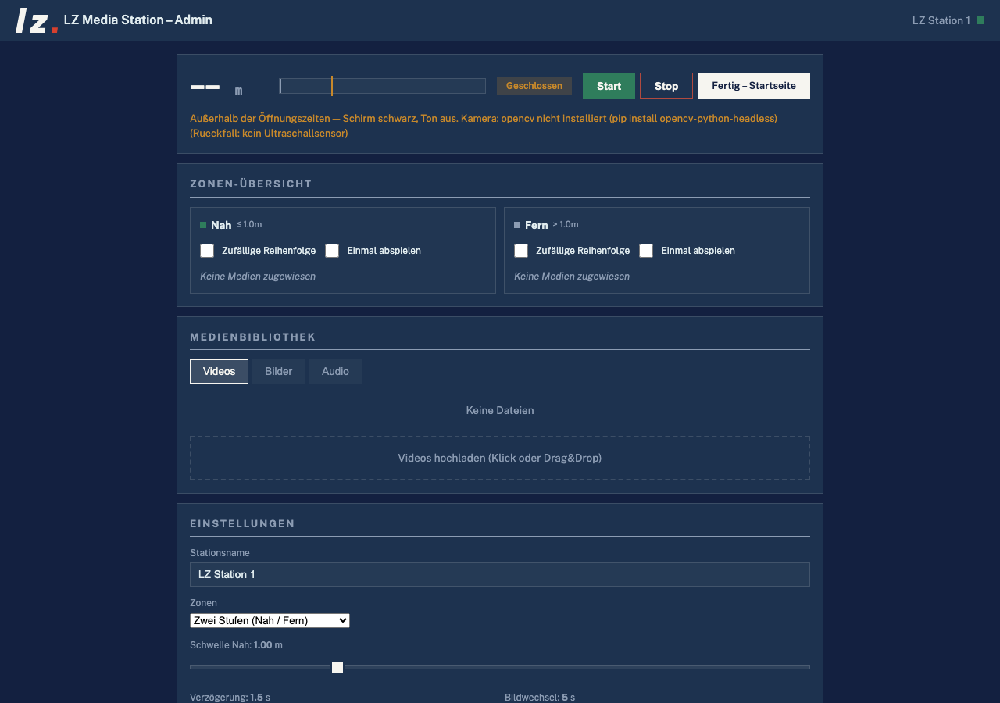

# LZ Media Station

> Sensor-gesteuerte Medien-Station mit Web-Admin, Display-Modus und Multi-Station Manager.
> Läuft auf **Raspberry Pi** (HC-SR04 Ultraschallsensor) sowie auf **Mac/Windows** (Kamera-Erkennung als Abstandsquelle).
> Ist kein Sensor da, übernimmt die Kamera von selbst — `sensor_type: "auto"` ist die Vorgabe ([Details](docs/sensoren.md)).

[](https://github.com/larszu/pi-media-station/releases)



---

## The web page

Every push to the default branch builds this repo's page from
`.github/workflows/pages.yml` and publishes it:

**https://larszu.github.io/pi-media-station/**

The workflow **asks the Pages API before it configures anything.** With no
Pages site it still builds — that is a real check — and skips only the
publishing step, with a warning and the one missing step in the run summary.
A run that must stay red for a click nobody made teaches people to ignore red.

Measured 2026-09-09: **built, not published.** The build runs and passes; the
`deploy` job is skipped because this repo has no Pages site yet. That switch is
the one thing no workflow can flip (`GITHUB_TOKEN` may not create a site):
Settings → Pages → Source → **GitHub Actions**. After that the next push
publishes by itself — nothing in this repo needs changing.

---
## Inhalt

- [Features](#features)
- [Schnellstart Raspberry Pi](#schnellstart-raspberry-pi)
- [Manuelles Deploy / Update](#manuelles-deploy--update)
- [Bedienung](#bedienung)
- [Multi-Station Manager (Desktop-App)](#multi-station-manager-desktop-app)
- [Architektur](#architektur)
- [API-Übersicht](#api-übersicht)
- [Dokumentation](#dokumentation)
- [Troubleshooting](#troubleshooting)
- [Tailscale (Remote-Verwaltung)](#tailscale-remote-verwaltung)
- [Erscheinungsbild](#erscheinungsbild)

---

## Features

### Sensor-/Medien-Kern
- **Drei wählbare Abstandsquellen** (`sensor_type`):
  - **HC-SR04 Ultraschallsensor** an GPIO 23 (Trigger) / GPIO 24 (Echo) — frei konfigurierbar (Vorgabe)
  - **Kamera-Erkennung** über eine Webcam (OpenCV + YuNet/Haar) — läuft auch auf **Mac und Windows**, siehe [`docs/sensoren.md`](docs/sensoren.md)
  - **Taster**: der Besucher drückt einen Knopf, statt gemessen zu werden
- **Kein Demo-Modus mehr**: ist kein Sensor angeschlossen, misst die Station nichts und löst nicht aus — die Oberfläche sagt es im Klartext, statt eine erfundene Distanz zu zeigen
- **Zustandsprüfung**: Sensor ohne Messung, volle Platte, Zone ohne Medien, fehlende Dateien — sichtbar im Admin und über `/api/identity` für den Station Manager
- **Besucher-Statistik**: Besuche und Verweildauer pro Tag/Stunde, CSV-Export — ohne irgendetwas über einzelne Personen zu speichern, siehe [`docs/statistik-und-zustand.md`](docs/statistik-und-zustand.md)
- **Zeitsteuerung**: Wochenplan mit Öffnungszeiten (auch über Mitternacht) — außerhalb bleibt der Schirm schwarz, der Ton aus und es wird nicht ausgelöst; optional Fernseher per HDMI-CEC mit abschalten, siehe [`docs/zeitsteuerung.md`](docs/zeitsteuerung.md)
- **Zwei oder drei Zonen**: NAH / FERN, optional mit MITTE dazwischen — mit konfigurierbarer Verzögerung gegen Flackern, siehe [`docs/zonen.md`](docs/zonen.md)
- **Pro Zone** beliebige Auswahl an Videos, Bildern und Audio
- **Gleichtakt mehrerer Stationen**: eine Station folgt der Zone einer anderen über das LAN — ein Sensor treibt eine ganze Wand, siehe [`docs/gleichtakt.md`](docs/gleichtakt.md)
- **Mehrsprachigkeit**: Untertitelspuren (WebVTT) je Video mit Sprachknöpfen auf der Anzeige, siehe [`docs/mehrsprachigkeit.md`](docs/mehrsprachigkeit.md)
- **Playlist-Optionen je Zone**: zufällige Reihenfolge, „einmal abspielen", Reihenfolge umsortieren und eigene Standzeit je Bild, siehe [`docs/zonen.md`](docs/zonen.md)
- **Bildslideshow** mit einstellbarem Intervall
- **Lautstärke** getrennt für Master / Video / Audio (0–100 %)
- **Video-Resume**: Optional Wiedergabe an gleicher Stelle fortsetzen, statt von vorne

### Web-Admin (`/admin`)
- Zonen-Übersicht mit Drag-Zuordnung
- Medien-Bibliothek mit Tabs (Videos / Bilder / Audio)
- **Drag-and-Drop-Upload** mit Fortschrittsanzeige und **Medien-Check** (warnt vor 4K/60fps/fremdem Codec, der auf dem Pi ruckelt)
- **Sicherung**: Konfiguration exportieren und einspielen — zum Klonen einer Station oder nach SD-Karten-Defekt, siehe [`docs/betrieb.md`](docs/betrieb.md)
- Datei-Löschung **nicht-destruktiv**: entfernt nur aus Zonen, die Datei bleibt auf dem Pi
- Live-Status: Distanz, aktive Zone, Klartext-Zustand der Abstandsquelle
- Einstellungen: Stationsname, Schwelle, Verzögerung, Bildwechsel, Lautstärken, Video-Resume

### Systemeinstellungen (eigener Bereich in `/admin`)
- **Abstandsquelle wählbar**: Ultraschall (GPIO Trigger/Echo), Kamera (Index, Brennweite) oder Taster (Pin, Haltezeit)
- **Gleichtakt**: dieser Station eine andere als Taktgeber zuweisen
- **Anzeige-IP** für Fernsteuerung (leer = Auto-Erkennung)
- **Netzwerk** via `nmcli`:
  - DHCP / statische IP wählbar
  - IP/CIDR, Gateway, DNS direkt konfigurierbar
- **WLAN-Steuerung**:
  - WLAN ein/aus per Toggle
  - Netzwerk-Scan mit Signal-Stärke und Verschlüsselung
  - SSID per Klick übernehmen, Passwort eingeben → verbinden
- **Pi-Reboot** direkt aus der UI

### Startseite (`/`) und Anzeige (`/display`)
- `/` ist ein kleines Menü mit den Links zu Anzeige und Verwaltung — **diese Seite öffnet der Kiosk beim Boot**
- `/display` ist der Vollbild-Player (Chromium `--kiosk`), mit Überblendungen, Untertitel-Spuren und Sprachknöpfen
- ESC öffnet von beiden aus `/admin`
- Auto-Verstecken des Cursors auf der Anzeige

### Manager Desktop-App (`station-manager/`)
- Verwaltet **mehrere Pi-Stationen** zentral
- **Auto-Discovery** via mDNS (`_lzstation._tcp` über Avahi)
- **Manuelles Hinzufügen** per IP/Hostname
- Live-Polling: Online-Status, Distanz, Zone
- **Bulk-Aktionen**: Start / Stop / Reboot
- **Bulk-Upload**: dieselbe Datei an N Stationen gleichzeitig
- **Config-Push**: Stationsname, Schwelle, Verzögerung
- Direktsprung in die Web-Admin-UI jeder Station
- Builds für **Windows (NSIS + Portable)**, **macOS (Intel + Apple Silicon)**, **Linux (AppImage)**

---

## Auf dem eigenen Rechner starten — ohne Pi

```bash
./run-local.sh          # Linux / macOS
run_windows.bat         # Windows (Doppelklick)
run_windows.bat --server  # Windows, für einen Aufrufer: Vordergrund, kein Browser
```

Mehr braucht es nicht: Python 3.10+. Das Skript legt beim ersten Lauf eine
`.venv` an, installiert `requirements.txt` und startet den Server.

**Ohne Sensor wird nichts erfunden.** Fehlt `gpiozero` oder ein GPIO-Chip
(also auf jedem Entwicklungsrechner), misst der Ultraschallsensor nichts:
`distance` bleibt „unbekannt", es wird nicht ausgelöst, und der Admin zeigt im
Klartext, dass kein Sensor angeschlossen ist. Den früheren Zufalls-Demo-Modus
gibt es nicht mehr — er ließ die Station so aussehen, als messe sie. Wer auf
Mac/Windows ohne Ultraschall-Hardware entwickeln oder ausstellen will, stellt
im Admin unter **Abstandsquelle** auf **Kamera** (Webcam) um; die Einrichtung
steht in [`docs/sensoren.md`](docs/sensoren.md).

`start.sh` ist etwas anderes und bleibt es: der **Kiosk**-Start auf dem
Pi. Er wartet auf einen Wayland-Socket, erschießt `piwiz` und `zenity` und
startet Chromium im Vollbild. Auf einem Notebook läuft davon nichts, und
der Abbruch kommt beim Wayland-Socket — also mit einer Meldung über ein
fehlendes Fenster statt über die Sache.

### Dieser Rechner ist auch ein Mediaplayer — mit allen Bildschirmen

```bash
python3 main.py --list-displays     # was hängt hier?
python3 main.py --play-on all       # Anzeige auf jedem Schirm
python3 main.py --play-on 0,2       # nur auf diesen beiden
```

Bis 2026-09-15 gab es genau **einen** Schirm, und der war der HDMI-Ausgang
eines Raspberry Pi. Die Anzeige ist seit jeher eine Browser-Seite
(`/display`); auf dem Pi öffnet sie ein Chromium im Kiosk-Betrieb, und mehr
Bildschirme hat ein Pi in diesem Aufbau nicht. Auf einem Notebook oder
einem Rechner am Aufbau hängt oft mehr als einer — **der eingebaute zählt
mit** —, und davon konnte die Station nichts nutzen. Wer zwei Schirme
bespielen wollte, brauchte zwei Rechner.

Die Schirme stehen auch im Web-Admin, mit einem Knopf je Schirm. Die Karte
erscheint nur, wenn es etwas zu zeigen gibt: auf einem Pi ohne X wäre eine
leere Liste mit zwei wirkungslosen Knöpfen schlimmer als keine Karte.

**Gefunden werden sie auf dem Weg, den das System selbst anbietet:**

| Windows | `ctypes` → `user32.EnumDisplayMonitors` (Standardbibliothek) |
|---|---|
| macOS | `system_profiler SPDisplaysDataType -json` |
| Linux | `xrandr --listmonitors` |

Keine neue Abhängigkeit.

**Der ehrliche Teil: warum Position und nicht „Schirm Nummer 2".** Es gibt
keinen Weg, einem Browser zu sagen „geh auf Schirm 2 in den
Vollbildmodus". Was es gibt, ist ein Fenster an einer **Position**: jeder
Schirm hat im gemeinsamen Koordinatensystem eine Ecke, und ein Fenster, das
dort aufgeht, liegt auf diesem Schirm. Genau das tun `--window-position`
und `--window-size`.

Daraus folgen zwei Grenzen, die hier stehen statt sich zu verstecken:

* Wer die Schirme in den Systemeinstellungen **verschiebt, während ein
  Fenster offen ist**, bekommt es nicht nachgeführt. Aufgezählt wird beim
  Öffnen.
* macOS nennt in seiner Ausgabe **keine Koordinaten**. Die Ecken werden
  deshalb aus den Breiten aufgereiht: Hauptschirm bei 0/0, die übrigen
  rechts daneben. Wer seine Schirme übereinander legt, bekommt das Fenster
  an der falschen Stelle — es geht dann trotzdem auf und lässt sich
  verschieben.

**Chrome, Chromium oder Edge.** Firefox und Safari können kein Fenster auf
einem bestimmten Schirm öffnen, deshalb stehen sie nicht in der Liste.
Findet die Station keinen Browser, sagt sie, **wo sie gesucht hat** — ein
„geht nicht" ohne Ort ist für den Nutzer dasselbe wie Schweigen.

Und jeder Schirm bekommt ein eigenes Browser-Profil. Ohne das bleibt der
zweite schwarz: ein zweiter Chrome-Aufruf mit demselben Profil faltet sich
in das bestehende Fenster, statt ein neues zu öffnen.

`tests/test_displays.py` misst die Auswertung gegen echte Ausgaben von
`system_profiler` und `xrandr` — in CI gibt es keinen Bildschirm, und die
Frage ist ohnehin eine andere: ob aus dem Text die richtige Ecke wird. Ein
echter Defekt kam dabei heraus: der erste Anlauf trennte die
xrandr-Geometrie an `+` und verlor damit jeden Schirm **links** vom
Hauptschirm (`-1920+0`) — also ausgerechnet den zweiten.

### Andere Geräte im selben Netz

Der Server bindet auf alle Schnittstellen, und **beim Start steht jetzt die
Adresse da, die man eintippen kann**:

```
  LZ Media Station
    hier:            http://127.0.0.1:5000/
    im selben Netz:  http://192.168.1.42:5000/

    Anzeige (Schirm am Aufbau):   http://192.168.1.42:5000/display
    Verwaltung (Handy/Notebook):  http://192.168.1.42:5000/admin
```

Vorher stand dort `http://0.0.0.0:5000`. Der Server war die ganze Zeit im
Netz erreichbar — nur ist `0.0.0.0` keine Adresse, sondern die Bind-Angabe
„alle Schnittstellen"; in einen Browser getippt landet sie je nach System
nirgends. Wer die Station aufbaute, bekam nie zu sehen, was er der Crew
sagen soll. Dieselben zwei Adressen stehen auch auf der Startseite der
Station.

Beliebig viele Geräte können gleichzeitig `/display` öffnen — ein zweiter
Schirm am Aufbau, ein Tablet im Foyer. `/admin` ist die Verwaltung.

**`--host 127.0.0.1` sperrt das ab.** Die Bind-Adresse war fest auf
`0.0.0.0` verdrahtet, ohne Möglichkeit, es zu lassen: auf einem Rechner in
einem fremden Netz (Hotel-WLAN, Messe, Kundennetz) stand die Verwaltung
damit offen, und niemand hatte es entschieden. Die Vorgabe bleibt
`0.0.0.0`, weil genau das der Zweck der Station ist — aber jetzt ist es
eine Entscheidung.

`tests/test_web_clients.py` fragt über die **LAN-Adresse** dieses Rechners
an, nicht über `localhost` — das ist derselbe Weg, den ein Handy nimmt —
und prüft die Gegenprobe mit: bindet `--host 127.0.0.1` wirklich nur lokal?
Ohne sie wäre der Schalter eine Beschriftung ohne Wirkung.

## Schnellstart Raspberry Pi

Frischer Pi (Raspberry Pi OS Bookworm, Wayland/labwc-Session, User `pi`):

```bash
curl -sSL https://raw.githubusercontent.com/larszu/pi-media-station/main/install_pi.sh | bash
```

Der Installer erledigt automatisch:

1. Systempakete (`python3-flask`, `python3-gpiozero`, `chromium-browser`, `avahi-daemon`, `git`)
2. Klont das Repo nach `~/pi_media_station`
3. Erstellt Medien-Ordner (`videos/`, `images/`, `audio/`, `subtitles/`)
4. Schreibt `~/.config/autostart/LZ_Media_Station.desktop`
5. Chromium-Policy: deaktiviert Translate-Banner
6. Unterdrückt störende Login-Dialoge (`gnome-keyring*`)
7. **Sudoers-Regel** für `nmcli` und `reboot` (passwortlos für `pi`)
8. **Avahi-Service** `_lzstation._tcp` für mDNS-Discovery durch den Manager

Nach Installation:

```bash
~/pi_media_station/start.sh    # sofort starten
# ODER
sudo reboot                    # nutzt Autostart
```

Web-UI dann unter `http://<pi-ip>:5000/admin`.

---

## Manuelles Deploy / Update

### Erstmaliges Klonen

```bash
git clone https://github.com/larszu/pi-media-station.git ~/pi_media_station
cd ~/pi_media_station
chmod +x start.sh install_pi.sh
bash install_pi.sh   # idempotent, erkennt vorhandenes Repo
```

### Update auf neueste Version

```bash
cd ~/pi_media_station
git pull
pkill -f 'python3 main.py' || true
nohup python3 main.py >/tmp/main.log 2>&1 &
```

oder einfacher:

```bash
sudo reboot
```

### Einzeldateien per SCP (vom Entwickler-PC)

```powershell
# Windows PowerShell
cd "c:\Users\<user>\Documents\LZ Media Station\pi_media_station"
scp web_ui.py templates/admin.html static/app.js pi@<pi-ip>:/tmp/
ssh pi@<pi-ip> "cp /tmp/web_ui.py ~/pi_media_station/web_ui.py && \
                cp /tmp/admin.html ~/pi_media_station/templates/ && \
                cp /tmp/app.js ~/pi_media_station/static/ && \
                pkill -f 'python3 main.py' || true; \
                sleep 2; cd ~/pi_media_station; \
                setsid nohup python3 main.py >/tmp/main.log 2>&1 < /dev/null &"
```

### Auf Windows lokal entwickeln

```cmd
run_windows.bat
```

Startet Flask auf `http://localhost:5000`. Ohne Ultraschall-Hardware misst die
Station nichts; für eine Webcam im Admin unter **Abstandsquelle** auf
**Kamera** umstellen (siehe [`docs/sensoren.md`](docs/sensoren.md)).

---

## Bedienung

### Web-Admin (`/admin`)

| Bereich | Funktion |
|---|---|
| **Status** | Distanz (bzw. Gedrückt/Frei beim Taster), Zone, Start/Stop, Klartext-Zustand der Quelle |
| **Zustand** | Befunde der Zustandsprüfung — toter Sensor, volle Platte, fehlende Dateien |
| **Statistik** | Besuche heute/gesamt, Tagesverlauf, letzte Tage, CSV-Download |
| **Sicherung** | Konfiguration exportieren und einspielen |
| **Zonen** | Je Zone: Shuffle, „einmal abspielen", Reihenfolge (▲▼), Standzeit je Bild |
| **Bibliothek** | Upload (mit Medien-Check), Zuweisung per Knopf je Zone, Löschen nur aus Zonen |
| **Untertitel** | Sprachen festlegen, `.vtt` hochladen, je Video und Sprache zuordnen |
| **Einstellungen** | Name, Zonen-Stufen, Schwellen, Verzögerung, Bildintervall, Lautstärken, Video-Resume |
| **Zeitsteuerung** | Wochenplan, HDMI-CEC |
| **Über** | Hauptlogo, Name, Version |
| **Systemeinstellungen** | Abstandsquelle, Gleichtakt, Anzeige-IP, Netzwerk, WLAN, Reboot |

Die Zuweisung eines Mediums zu einer Zone passiert in der **Bibliothek** über
einen Knopf je Zone, die Reihenfolge in der **Zonen-Übersicht** über Pfeile —
bewusst kein Drag-and-Drop: diese Seite wird vom Handy bedient, und Ziehen mit
dem Daumen ist dort der unzuverlässigste Weg.

### Anzeige (`/display`)

- ESC → `/admin`
- Beim Pi-Boot lädt der Chromium-Kiosk die **Startseite `/`** (siehe `start.sh`);
  von dort geht es mit einem Klick auf die Anzeige. Ein zweites Gerät kann
  `/display` auch direkt öffnen.

### Netzwerk konfigurieren

In `/admin` → **Systemeinstellungen** → **Netzwerk**:

1. Aktive Verbindung wählen
2. **DHCP** oder **Statisch**
3. Bei statisch: IP/CIDR (z. B. `192.168.1.50/24`), Gateway, DNS
4. **Netzwerk übernehmen**

> Verbindung wird kurz getrennt — danach neue IP im Browser eingeben.

### WLAN konfigurieren

In `/admin` → **Systemeinstellungen** → **WLAN**:

1. WLAN-Toggle aktivieren
2. **Netzwerke scannen**
3. SSID anklicken → Passwort eingeben
4. **Mit WLAN verbinden**

> Bei aktiver Ethernet-Verbindung bleibt diese bestehen — du kannst Pi parallel per WLAN ins Netz bringen.

---

## Multi-Station Manager (Desktop-App)

Im Ordner `station-manager/` liegt der **LZ Media Station Manager**, eine Electron-App für Win/Mac/Linux.

### Entwicklung

```bash
cd station-manager
npm install
npm start
```

### Build (Distributables)

```bash
npm run dist:win    # Windows: NSIS Installer + Portable .exe
npm run dist:mac    # macOS: DMG für Intel + Apple Silicon
npm run dist        # plus Linux AppImage
```

Artefakte in `station-manager/dist/`.

### Workflow

1. **Discovery**: alle Pis im LAN mit Avahi-Service erscheinen automatisch
2. **Manuell adden**: per IP wenn mDNS nicht durchkommt (z. B. via Tailscale)
3. **Auswahl**: Karten anklicken → Bulk-Aktionen aktiv
4. **Bulk**: Start / Stop / Reboot, Media-Upload, Config-Push
5. **Admin öffnen**: pro Karte öffnet `/admin` im System-Browser

Persistente Daten der installierten App: `%APPDATA%\LZ Station Manager\stations.json` (Win) bzw. `~/Library/Application Support/LZ Station Manager/` (Mac) – der Ordnername von vor der Umbenennung bleibt, damit Updates ihre Stationen finden. Beim Start aus dem Quellcode (`npm start`) heißt der Ordner `station-manager`.

---

## Architektur

```
                ┌─────────────────────────────┐
                │  LZ Media Station Manager   │
                │  Electron · Win/macOS/Linux │
                └──────────────┬──────────────┘
                               │ HTTP/JSON (LAN oder Tailscale)
        ┌──────────────────────┼──────────────────────┐
        │                      │                      │
   ┌────▼────┐            ┌────▼────┐            ┌────▼────┐
   │ Pi #1   │            │ Pi #2   │            │ Pi #N   │
   │ Flask   │            │ Flask   │            │ Flask   │
   │ + Avahi │            │ + Avahi │            │ + Avahi │
   │ HC-SR04 │            │ HC-SR04 │            │ HC-SR04 │
   └─────────┘            └─────────┘            └─────────┘
```

**Pi-Stack:** (Wiedergabe passiert im Browser, nicht in Python — es gibt
keinen Player-Prozess.)

| Modul | Aufgabe |
|---|---|
| `main.py` | Controller: Zonen-Zustandsmaschine, Wochenplan, Statistik-Fortschreibung |
| `web_ui.py` | Flask-Routen (`/`, `/admin`, `/display`, `/api/*`) |
| `config_schema.py` | Vorgaben **und** Grenzen; Heilung beim Laden, Ablehnung beim Schreiben |
| `sensor.py` | Basis aller Abstandsquellen (Mittelwert, Veralten) + HC-SR04 |
| `camera_sensor.py` | Kamera-Quelle (OpenCV + YuNet/Haar), plattformübergreifend |
| `button_sensor.py` | Taster-Quelle am GPIO |
| `auto_sensor.py` | Wahl mit Rückfall: HC-SR04, und wenn es den nicht gibt, die Kamera |
| `sync.py` | Gleichtakt: folgt der Zone einer anderen Station |
| `zeitplan.py` | Öffnungszeiten (rein, ohne Uhr — deshalb testbar) |
| `statistik.py` | Besuche zählen, auswerten, atomar speichern |
| `gesundheit.py` | Zustandsprüfung (rein, Lage wird hereingereicht) |
| `medien_check.py` | Beurteilt hochgeladene Videos (ffprobe optional) |
| `tv_cec.py` | Fernseher per HDMI-CEC schalten (wirft nie) |
| `displays.py` | Bildschirme dieses Rechners finden und bespielen |
| `static/`, `templates/` | Frontend (Admin, Anzeige, Startseite) |
| `lzstation.service` | Avahi mDNS für die Manager-Discovery |

**Manager-Stack:**
- `main.js` – Electron-Hauptprozess, mDNS (`bonjour-service`), HTTP-Multipart-Upload
- `preload.js` – contextIsolation IPC-Bridge
- `renderer/` – UI

---

## API-Übersicht

Alle Endpoints unter `http://<pi-ip>:5000`.

### Zustand und Wiedergabe

| Method | Path | Beschreibung |
|---|---|---|
| GET | `/api/status` | Distanz, Zone, Sensor-Zustand, Betriebsruhe, IP, komplette Config |
| GET | `/api/scene` | Was gerade zu spielen ist: Zone, Zonen-Medien, Lautstärken, Untertitel |
| GET | `/api/sync` | **Takt für andere Stationen**: nur Zone + Betriebsruhe (siehe [Gleichtakt](docs/gleichtakt.md)) |
| GET | `/api/health` | Befunde der Zustandsprüfung + Gesamtstufe |
| GET | `/api/identity` | Station-ID, Name, Version, Zustandsstufe (Manager-Discovery) |
| POST | `/api/start` · `/api/stop` | Sensor-Steuerung starten / anhalten |

### Konfiguration

| Method | Path | Beschreibung |
|---|---|---|
| POST | `/api/config` | Konfiguration schreiben (**lehnt ab** und nennt das Feld). Gelesen wird sie über `/api/status` |
| GET | `/api/backup` | Konfiguration als JSON-Datei herunterladen |
| POST | `/api/restore` | Sicherung einspielen (**repariert** statt abzulehnen) |

### Medien

| Method | Path | Beschreibung |
|---|---|---|
| GET | `/api/media/<type>` | Dateiliste (`videos`, `images`, `audio`, `subtitles`) |
| POST | `/api/upload/<type>` | Multipart-Upload; bei Videos mit **Medien-Check** in der Antwort |
| DELETE | `/api/media/<type>/<name>` | Aus allen Zonen entfernen (Datei bleibt liegen) |
| GET | `/media/<type>/<name>` | Datei ausliefern |

### Statistik

| Method | Path | Beschreibung |
|---|---|---|
| GET | `/api/statistik` | Besuche heute/gesamt, Tagesverlauf, letzte Tage |
| GET | `/api/statistik.csv` | Tageswerte als CSV (Semikolon, Komma als Dezimalzeichen) |
| POST | `/api/statistik/reset` | Zähler auf null |

### Dieser Rechner und sein System

| Method | Path | Beschreibung |
|---|---|---|
| GET | `/api/displays` | Angeschlossene Bildschirme dieses Rechners |
| POST | `/api/displays/play` · `/api/displays/stop` | Anzeige-Fenster öffnen / schließen |
| GET/POST | `/api/system/network` | nmcli IP-Konfiguration |
| GET/POST | `/api/system/wifi` | WLAN ein/aus, Scan, Verbinden |
| POST | `/api/system/reboot` | `sudo reboot` |

---

## Dokumentation

Das README gibt den Überblick. Die Themen, die mehr als einen Absatz brauchen,
stehen in [`docs/`](docs/README.md) — dort steht das Wie und, wichtiger, das
**Warum**.

| Dokument | Worum es geht |
|---|---|
| [Abstandsquellen](docs/sensoren.md) | Ultraschall, Kamera, Taster; Kalibrierung; **Vergleichsmatrix** aller gängigen Sensortypen mit Empfehlung je Anwendungsfall |
| [Zonen und Wiedergabe](docs/zonen.md) | Zwei oder drei Stufen; Shuffle, „einmal abspielen", Reihenfolge, Standzeit je Bild |
| [Zeitsteuerung](docs/zeitsteuerung.md) | Wochenplan (auch über Mitternacht), HDMI-CEC |
| [Statistik und Zustand](docs/statistik-und-zustand.md) | Besucherzahlen, CSV-Export, Zustandsprüfung |
| [Mehrsprachigkeit](docs/mehrsprachigkeit.md) | Untertitelspuren je Video, Sprachknöpfe |
| [Gleichtakt](docs/gleichtakt.md) | Eine Station folgt der Zone einer anderen |
| [Betrieb](docs/betrieb.md) | Medien-Check beim Upload, Sicherung und Wiederherstellung |

**Zwei Regeln gelten überall:** Ohne Messung wird nichts erfunden — fehlt der
Sensor, die Kamera oder der Kontakt zum Taktgeber, gibt es *keinen* Wert, die
Station löst nicht aus und sagt im Klartext, warum. Und alle Vorgaben sind
rückwärtskompatibel: nach einem Update verhält sich eine bestehende
Installation exakt wie vorher, bis jemand etwas einschaltet.

---

## Troubleshooting

### Server läuft nicht nach Reboot

```bash
ssh pi@<pi-ip>
cat /tmp/main.log              # letzte Fehler
ps -ef | grep main.py          # läuft Prozess?
~/pi_media_station/start.sh    # manuell starten
```

### Manager findet Pi nicht

- Avahi prüfen: `systemctl status avahi-daemon`
- Service registriert? `ls /etc/avahi/services/lzstation.service`
- Fallback: manuell mit IP adden
- Firewall: Port 5000 freigegeben?

### nmcli verlangt Passwort

Sudoers-Regel fehlt:
```bash
cat /etc/sudoers.d/lz-media-station
# Sollte enthalten:
# pi ALL=(ALL) NOPASSWD: /usr/bin/nmcli, /sbin/reboot, /usr/sbin/reboot
```
Mit `bash install_pi.sh` neu erstellen.

### Display zeigt schwarzen Bildschirm

- Wayland-Env? `echo $WAYLAND_DISPLAY`
- `start.sh` setzt `XDG_RUNTIME_DIR=/run/user/1000` und `WAYLAND_DISPLAY=wayland-0`
- Chromium-Log: `tail /tmp/chromium.log`

### Status zeigt 127.0.0.1 statt LAN-IP

- Anzeige-IP in Systemeinstellungen manuell setzen, ODER
- Default-Route fehlt → mit `ip route` prüfen, ggf. Gateway setzen

### SSH-Hintergrundstart killt Server beim Logout

Statt `nohup ... &` immer `setsid` verwenden:
```bash
setsid nohup python3 main.py >/tmp/main.log 2>&1 < /dev/null &
```

---

## Tailscale (Remote-Verwaltung)

Für Multi-Standort oder Verwaltung von zuhause:

```bash
# Auf jedem Pi
curl -fsSL https://tailscale.com/install.sh | sh
sudo tailscale up
```

Auf dem Manager-Rechner ebenfalls Tailscale installieren und im selben Tailnet anmelden. Pis erreichen sich dann unter `100.x.y.z` oder `<pi-name>.<tailnet>.ts.net` (MagicDNS).

> mDNS funktioniert **nicht** über Tailscale → Stationen einmalig manuell im Manager mit ihrer Tailscale-Adresse hinzufügen.

---

## Erscheinungsbild

Alle Oberflächen folgen dem Brand Guide 2.0 der Lars Zumpe Medienproduktion: Deep Navy als Grund, Off-White als Aktionsfläche, Tally-Rot nur für Fokusring und den Punkt im Signet, keine Rundungen, Schatten oder Verläufe. `tests/test_brand_tokens.py` prüft das.

| Datei | Wofür |
|---|---|
| `static/brand/` | Favicon, App-Icon (192/512, Apple Touch), Signet „lz.", Hauptlogo und Wortmarke als Kontur — Web-Admin, Startseite, Anzeige, Projektseite |
| `static/manifest.webmanifest` | Name und Icons, wenn der Admin auf einem Handy zum Startbildschirm hinzugefügt wird |
| `station-manager/build/` | App-Icon des LZ Media Station Managers (`icon.png`, `icon.ico`) für electron-builder |
| `station-manager/renderer/brand/` | Signet, Hauptlogo und Fenster-Icon der Desktop-App |

Die Desktop-Einträge des Pi (`install_pi.sh`, `LZ_Media_Station.desktop`) zeigen `static/brand/icon-512.png`. Unter 640 px Breite fällt das Signet aus der Kopfzeile.

---

## Lizenz

Proprietär — © 2026 Lars Zumpe, alle Rechte vorbehalten. Nutzung der veröffentlichten Builds ist kostenlos; Weiterverbreitung und abgeleitete Werke sind es nicht. Siehe [LICENSE](LICENSE).
