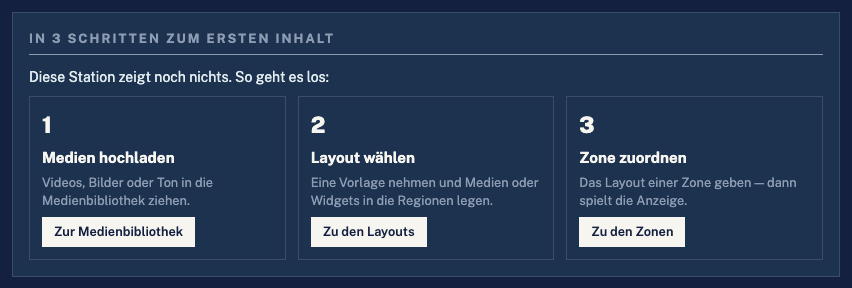
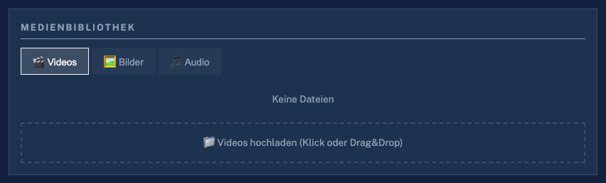
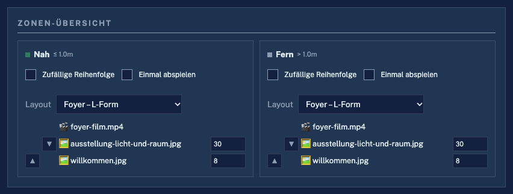
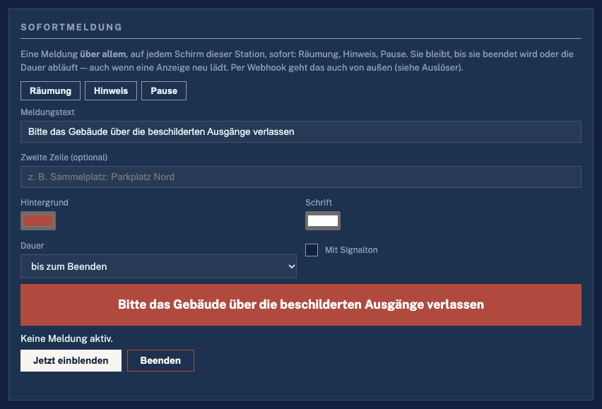
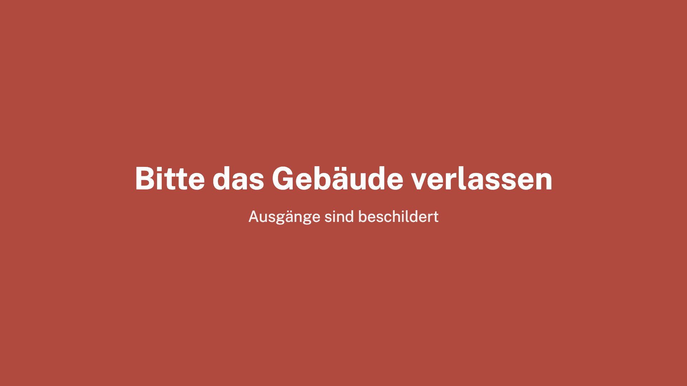
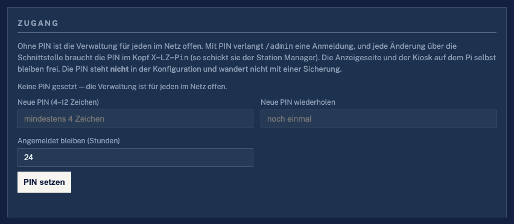

# Handbuch

Für alle, die eine LZ Media Station betreiben — im Foyer, in der
Ausstellung, am Messestand. Technikkenntnisse braucht es nicht. Wer tiefer
einsteigen will, findet die Einzelheiten in den übrigen Dokumenten
([Übersicht](README.md)).

---

## Inhalt

1. [Die Station in zwei Sätzen](#1-die-station-in-zwei-sätzen)
2. [Die Verwaltung öffnen](#2-die-verwaltung-öffnen)
3. [Der erste Inhalt in drei Schritten](#3-der-erste-inhalt-in-drei-schritten)
4. [Layouts: den Schirm aufteilen](#4-layouts-den-schirm-aufteilen)
5. [Zonen: was nah und was fern läuft](#5-zonen-was-nah-und-was-fern-läuft)
6. [Wochenprogramm: was wann läuft](#6-wochenprogramm-was-wann-läuft)
7. [Sofortmeldung: eine Nachricht über allem](#7-sofortmeldung-eine-nachricht-über-allem)
8. [Auslöser: wenn … dann …](#8-auslöser-wenn--dann-)
9. [Im Blick behalten: Monitor](#9-im-blick-behalten-monitor)
10. [Schützen: PIN für die Verwaltung](#10-schützen-pin-für-die-verwaltung)
11. [Sichern und wiederherstellen](#11-sichern-und-wiederherstellen)
12. [Mehrere Stationen: der Station Manager](#12-mehrere-stationen-der-station-manager)
13. [Wenn etwas nicht klappt](#13-wenn-etwas-nicht-klappt)

---

## 1. Die Station in zwei Sätzen

Die Station zeigt auf einem oder mehreren Bildschirmen Videos, Bilder,
Webseiten und kleine Anzeigen wie Uhr, Wetter oder Laufschrift. Was gerade
läuft, bestimmen **Sie** — über die Verwaltung im Browser — und auf Wunsch
auch die Besucher: tritt jemand näher an den Schirm, kann die Station etwas
anderes zeigen als für Vorbeigehende.

Drei Begriffe tauchen überall auf:

| Begriff | Bedeutung |
|---|---|
| **Layout** | Wie der Schirm aufgeteilt ist, zum Beispiel: großes Bild links, Uhr rechts, Laufschrift unten |
| **Region** | Ein Teil des Layouts. Jede Region zeigt ihre eigene Playlist oder ein Widget |
| **Zone** | Wie weit ein Besucher entfernt ist: **Nah** oder **Fern** (auf Wunsch auch **Mitte**). Jede Zone spielt ein Layout |

---

## 2. Die Verwaltung öffnen

Nach dem Einschalten zeigt der Bildschirm die **Startseite**:

- **Mit dem Handy:** den QR-Code scannen. Das Handy muss im selben Netz
  (WLAN) sein wie die Station. Die Verwaltung öffnet sich direkt.
- **Am Rechner:** die Adresse unter „Andere Geräte → Konfiguration“ in den
  Browser tippen, zum Beispiel `http://192.168.1.50:5000/admin`.
- **An der Station selbst:** auf **Konfiguration** tippen oder **Esc**
  drücken.

Gibt es schon Inhalte, startet die Startseite nach 15 Sekunden von selbst die
Anzeige. Ein Klick irgendwo hält den Countdown an.

Die Verwaltung gibt es auf **Deutsch und Englisch** — der Knopf **EN/DE**
oben rechts schaltet um.

---

## 3. Der erste Inhalt in drei Schritten

Solange die Station noch nichts zeigt, steht ganz oben in der Verwaltung
diese Karte:

**Schritt 1 — Medien hochladen.** In der **Medienbibliothek** den Reiter
wählen (Videos, Bilder oder Audio) und Dateien auf die Fläche ziehen oder die
Fläche antippen. Ein Balken zeigt den Fortschritt.

> Die Station prüft jedes Video beim Hochladen. Ist es zu groß für einen
> Raspberry Pi (zum Beispiel 4K oder 60 Bilder pro Sekunde), erscheint ein
> Hinweis. Die Datei bleibt trotzdem da — sie kann aber ruckeln. Am
> sichersten sind MP4-Videos in Full HD (1920 × 1080), 25 oder 30 Bilder
> pro Sekunde.

**Schritt 2 — Layout wählen.** In der Karte **Layouts** auf **Neues Layout**
tippen, eine Vorlage wählen und **Layout anlegen**. Dann Medien oder Widgets
in die Regionen legen — wie das geht, steht im nächsten Abschnitt.

**Schritt 3 — Zone zuordnen.** In der **Zonen-Übersicht** bei **Nah** und
**Fern** das neue Layout auswählen. Ab jetzt spielt die Anzeige.

Die Karte „In 3 Schritten“ verschwindet von selbst, sobald eine Zone etwas
zu zeigen hat.

---

## 4. Layouts: den Schirm aufteilen

### Ein Layout anlegen

1. **Neues Layout** → Namen eingeben → **Vorlage** wählen:
   - **Vollbild** — eine Fläche über den ganzen Schirm
   - **Geteilt** — zwei Flächen nebeneinander
   - **L-Form** — großes Bild, Seitenleiste rechts, Laufschrift unten
   - **Laufschrift** — Vollbild mit Laufschrift am unteren Rand
   - **Frei** — leer, Regionen selbst anlegen
2. **Layout anlegen**.

### Regionen anpassen

- **Verschieben:** eine Region auf der Leinwand ziehen.
- **Größe ändern:** an einer Ecke ziehen. Alles rastet in 5-%-Schritten ein.
- **Neue Region:** **Region hinzufügen**.
- **Übereinander:** mit ▲ ▼ festlegen, welche Region oben liegt.
- **Hochformat-Schirm:** oben auf **9:16** umschalten (ändert nur die
  Ansicht im Editor).
- Am Handy geht das alles mit einem Finger.

Eine Region antippen öffnet rechts ihre Einstellungen: **Bezeichnung**,
**Inhalt** (Medien oder Widget), **Ton**, **Übergang** (weiche Blende oder
harter Schnitt), **Zufällige Reihenfolge**, **Einmal abspielen**.

> **Ton:** In einem geteilten Layout sollte nur eine Region Ton haben —
> sonst spielen zwei Videos gleichzeitig ihren Ton.

### Die Playlist einer Region

Unter **Playlist dieser Region** Einträge aus der Bibliothek hinzufügen:
antippen oder hineinziehen. Eine **Webseite** kommt über ihre Adresse dazu.
Für jeden Eintrag lässt sich festlegen:

- **Standzeit** — wie lange ein Bild oder eine Webseite stehen bleibt
  (Videos laufen so lange, wie sie dauern);
- **Gültig von / bis** — zum Beispiel ein Plakat, das nur während der
  Sommerausstellung läuft. Nach dem Enddatum verschwindet es vom Schirm, ohne
  dass jemand daran denken muss.

Die Reihenfolge ändert sich durch Ziehen oder mit ▲ ▼.

### Widgets

Wird eine Region auf **Widget** gestellt, erscheint eine Liste:

| Widget | Wofür |
|---|---|
| **Uhr** | Uhrzeit und Datum, digital oder analog |
| **Text** | Eine Textfolie mit Vorlagen: Willkommen, Wegweiser, Speisekarte, Hinweis, Öffnungszeiten |
| **Laufschrift** | Eigener Text oder die Schlagzeilen eines Nachrichten-Feeds |
| **Wetter** | Aktuell und drei Tage, für einen Ort (ohne Anmeldung) |
| **Nachrichten** | Die neuesten Meldungen eines RSS-Feeds |
| **Kalender** | Termine aus einem Online-Kalender, auch als Raumbelegung („Jetzt / Danach“) |
| **QR-Code** | Ein Code zu einer Adresse, zum Beispiel zum Programm auf dem Handy |
| **Webseite** | Eine Internetseite, die regelmäßig neu lädt |
| **Zähler** | Countdown bis zu einem Termin |
| **Eigenes HTML** | Selbst gebaute Anzeigen (für Fortgeschrittene, siehe [Widgets](widgets.md)) |

Wetter, Nachrichten und Kalender brauchen Internet. Fällt es aus, bleibt der
letzte Stand stehen.

### Speichern und Vorschau

**Layout speichern** nicht vergessen — solange etwas ungespeichert ist,
steht es unter dem Knopf.

Die **Live-Vorschau** darunter zeigt das Layout genau so, wie es auf dem
Schirm läuft. Mit **Zeitpunkt simulieren** lässt sich prüfen, wie es an
einem anderen Tag aussieht — etwa ob ein Plakat nächste Woche noch gilt.
**Vollbild öffnen** zeigt die Vorschau im ganzen Fenster.

**Was läuft gerade?** (oben in der Statuskarte) zeigt stumm, was der echte
Bildschirm in diesem Moment spielt.

---

## 5. Zonen: was nah und was fern läuft

Jede Zone bekommt ihr Layout. Ist ein Abstandssensor oder eine Kamera
angeschlossen, wechselt die Station zwischen den Zonen, sobald jemand näher
kommt oder geht. Ohne Sensor läuft einfach die Zone **Fern**.

Wo die Grenze zwischen Nah und Fern liegt und wie lange ein Besucher stehen
muss, bevor umgeschaltet wird, steht unter **Einstellungen**. Die
Einzelheiten zu Sensoren: [Abstandsquellen](sensoren.md).

> Die Station erfindet keine Werte: ist kein Sensor angeschlossen, sagt sie
> das in der Statuskarte, statt einen Abstand anzuzeigen.

---

## 6. Wochenprogramm: was wann läuft

Das Wochenprogramm legt fest, welches Layout **zu welcher Zeit** läuft —
morgens das Tagesprogramm, abends der Film, am Wochenende die Begrüßung.

- **Eintrag anlegen:** im Kalender über die gewünschten Stunden **ziehen**.
  Name und Layout eintragen, **Eintrag speichern**. Alternativ **+ Eintrag**.
- **Eintrag ändern oder löschen:** auf den Block tippen.
- **Priorität** (1–9): überlappen sich zwei Einträge, gewinnt der mit der
  höheren Zahl. So lässt sich eine einmalige Vernissage über das normale
  Abendprogramm legen.
- **Über Mitternacht:** ein Ende vor dem Beginn (20:00 bis 02:00) läuft in
  den nächsten Tag.
- **Ausnahmetage:** unter dem Kalender ein Datum eintragen, etwa einen
  Feiertag. Ein Ausnahmetag gewinnt vor allem anderen.
- **Was läuft jetzt?** zeigt, welcher Eintrag gerade gilt.

Ohne Eintrag spielt jede Zone ihr Layout aus der Zonen-Übersicht.

**Öffnungszeiten** sind etwas anderes: außerhalb der Öffnungszeiten bleibt der
Schirm schwarz und der Ton aus. Sie stehen in der Karte **Zeitsteuerung**
([Einzelheiten](zeitsteuerung.md)).

---

## 7. Sofortmeldung: eine Nachricht über allem

Für den Moment, in dem alle Bildschirme sofort etwas anderes sagen müssen:
Räumung, ein kurzfristiger Hinweis, eine Pause.

1. Eine Vorlage antippen (**Räumung**, **Hinweis**, **Pause**) oder selbst
   schreiben.
2. Farben und **Dauer** wählen; auf Wunsch **Mit Signalton**.
3. **Jetzt einblenden.**

Die Meldung liegt über allem, auf jedem Schirm dieser Station:

**Beenden** nimmt sie wieder weg; mit einer Dauer verschwindet sie von
selbst. Auch wenn ein Bildschirm zwischendurch neu startet, bleibt sie
stehen.

---

## 8. Auslöser: wenn … dann …

Auslöser lassen die Station auf Ereignisse reagieren — ohne dass jemand die
Verwaltung öffnen muss.

**+ Auslöser** → Namen geben → **Wenn …** wählen → **… dann** wählen →
**Auslöser speichern**.

| Wenn … | Beispiel |
|---|---|
| **Webhook** | Ein Knopf am Empfang, die Hausautomation (Home Assistant, Node-RED, ioBroker) ruft eine Adresse auf |
| **Taster am GPIO** | Ein Knopf direkt am Raspberry Pi |
| **Uhrzeit** | Jeden Werktag um 8:30 |
| **Video zu Ende** | Nach dem Film |
| **Zonenwechsel** | Ein Besucher kommt nah heran |

| … dann | Wirkung |
|---|---|
| **Layout einblenden** | Für eine Weile ein anderes Layout, danach zurück |
| **Sofortmeldung zeigen** | Wie in Abschnitt 7 |
| **Schirm schwarz / wieder an** | Auf Wunsch schaltet der Fernseher mit ab (HDMI-CEC) |
| **Sensor-Steuerung starten / anhalten** | Zonenwechsel ein- oder ausschalten |

Mit **Test** lässt sich jeder Auslöser sofort ausprobieren. Das **Protokoll**
darunter zeigt, was wann ausgelöst hat.

Für Webhooks zeigt die Karte die fertige Adresse und ein Beispiel. Ein
**Token** schützt die Adresse davor, dass jemand anderes sie aufruft.
Einzelheiten: [Auslöser](ausloeser.md).

---

## 9. Im Blick behalten: Monitor

Der Monitor zeigt:

- **Verbundene Anzeigen** — welche Bildschirme sich melden und was sie in
  jeder Region gerade spielen. Meldet sich ein Schirm nicht mehr, steht er
  hier als „offline“.
- **Screenshot jetzt** — ein Bild von dem, was der Schirm gerade zeigt.
  Praktisch, wenn Sie nicht vor Ort sind.
- **System** — Temperatur, Auslastung, Speicherplatz (soweit das Gerät sie
  liefert).
- **Proof-of-Play** — was wie oft gelaufen ist, nach Datei, Tag oder
  Layout; als CSV-Datei für Auftraggeber oder Sponsoren. Über Personen wird
  dabei nichts gespeichert.
- **Benachrichtigung** — eine Nachricht aufs Handy (über die App **ntfy**),
  wenn etwas nicht stimmt oder ein Bildschirm ausfällt. **Testnachricht
  senden** prüft die Einrichtung.

Mehr dazu: [Monitoring](monitoring.md).

---

## 10. Schützen: PIN für die Verwaltung

Ohne PIN kann jeder im selben Netz die Verwaltung öffnen. Mit einer **PIN**
(4 bis 12 Zeichen) verlangt die Verwaltung eine Anmeldung.

- **PIN setzen:** in der Karte **Zugang** eingeben, wiederholen,
  **PIN setzen**.
- **Ändern:** bisherige PIN und neue PIN eingeben.
- **Aufheben:** **PIN aufheben**.

Die Anzeige läuft ohne Anmeldung weiter, und am Gerät selbst ist keine PIN
nötig. Die PIN steckt nicht in einer Sicherung. Der Station Manager fragt sie
einmal ab. Einzelheiten: [Zugang](zugang.md).

---

## 11. Sichern und wiederherstellen

In der Karte **Sicherung**:

- **Konfiguration sichern** lädt eine Datei mit allen Einstellungen herunter
  (Zonen, Layouts, Wochenprogramm, Auslöser, Zeitsteuerung, Sensor,
  Lautstärken).
- **Sicherung einspielen** lädt sie auf dieselbe oder eine andere Station —
  so lässt sich eine Station klonen oder nach einem Defekt der Speicherkarte
  wiederherstellen.

Die **Medien** (Videos, Bilder, Ton) sind nicht in der Sicherung. Laden Sie
sie auf der neuen Station wieder hoch — oder verteilen Sie sie mit dem
Station Manager auf mehrere Stationen auf einmal. Einzelheiten:
[Betrieb](betrieb.md).

---

## 12. Mehrere Stationen: der Station Manager

Der **Station Manager** ist ein Programm für Windows und Mac. Er
findet alle Stationen im Netz von selbst und zeigt sie als Kacheln — mit
Vorschaubild, aktivem Layout und Zustand.

- Stationen in **Gruppen** und mit **Tags** ordnen (etwa „Erdgeschoss“,
  „Messe“).
- Mehrere Stationen auswählen und **auf einmal**: ein Layout zuweisen, ein
  Layout oder das Wochenprogramm kopieren, eine Sofortmeldung schicken,
  Dateien hochladen, neu starten.
- **Alarme**: fällt eine Station aus, meldet der Manager das.
- Ein Klick auf eine Station öffnet ihre Verwaltung direkt im Manager.

Den Manager gibt es auf der
[Release-Seite](https://github.com/larszu/lz-media-station/releases/latest).

---

## 13. Wenn etwas nicht klappt

| Problem | Was hilft |
|---|---|
| **Der Schirm bleibt schwarz** | Unten steht eine kleine Zeile, warum. „Kein Inhalt zugewiesen“: der Zone ein Layout mit Inhalt geben (Abschnitt 3). Außerhalb der Öffnungszeiten ist Schwarz gewollt (Karte **Zeitsteuerung**). |
| **„Verbindung zur Station unterbrochen – läuft weiter“** | Die Anzeige erreicht die Station nicht; sie spielt die letzte Szene weiter. Netz und Stromversorgung der Station prüfen. |
| **Das Handy findet die Verwaltung nicht** | Handy und Station müssen im selben WLAN sein. Die Adresse auf der Startseite abtippen. |
| **Video ruckelt** | Das Video kleiner speichern: MP4, Full HD, 25 oder 30 Bilder pro Sekunde (Hinweis beim Hochladen beachten). |
| **Die Zonen wechseln nicht** | Die Statuskarte sagt, ob der Sensor misst. Ohne Messung wechselt nichts — das ist Absicht. Siehe [Abstandsquellen](sensoren.md). |
| **Wetter, Nachrichten oder Kalender zeigen nichts Neues** | Diese Widgets brauchen Internet. Ohne Netz bleibt der letzte Stand stehen. |
| **PIN vergessen** | Am Gerät selbst (direkt an der Station) ist keine PIN nötig: dort die Verwaltung öffnen und unter **Zugang** eine neue PIN setzen. |
| **Ein Bildschirm fehlt im Monitor** | Den Schirm neu starten oder `/display` auf ihm öffnen. Er meldet sich innerhalb von zehn Sekunden. |

Hilft das nicht weiter, steht in der Karte **Zustand**, was die Station
selbst für ein Problem hält.
